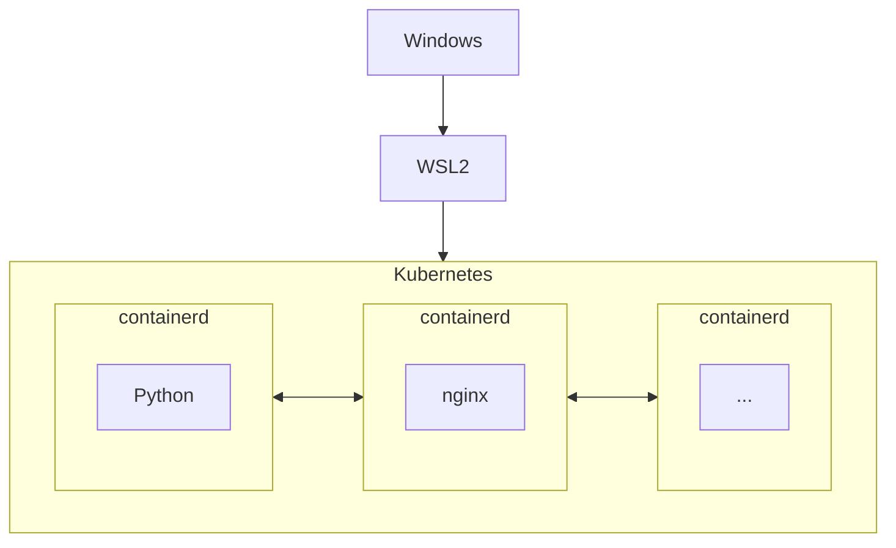

## 経緯
- おじさんパイソン勉強しちゃうぞーと思たら`C:\Users\私の 名前\AppData\Roaming\Python\Python312\Scripts`になって発狂。~~これだからWindowsは~~
- やっぱLinuxよと思ってDocker上げたらKubernetesが非推奨にしてて草。Dockerオワコンって書いた人が燃えたり何があったん？(15年くらい技術から離れてたおっさん)
- ざっと経緯を勉強してDockerでも問題ないしVSCode使うならDockerのほうが便利まであるけど、ついでなのでWSL2でcontainerdを動かしKubernetesに管理させる方向で再構築したのでメモ。

## 環境の概要
1.  Windows上の仮想環境WSL
    WindowsのWSL(Windows Subsystem for Linux)は2020年Ver2になり、Hyper-V仮想環境で(本物の)Linuxカーネルが動くようになった(それまではLinuxシステムコールを片っ端からWindowsシステムコールに変換していた)。オーバーヘッドは5%弱と無視できる範囲(ただしLinux ⇔ Windows間ファイルシステムIOに限って激遅になる。ファイル管理もWSL上で完結し、コードはGitHubに投げておけば問題ない)。
    WSL自体はプラットフォームで、主要なディストリビューションを導入できるし複数ディストリビューションの共存も可能。
- かつてKubernetesとDockerはセットで語られてた(このへんは何となく知ってる)が、DockerはKubernetesが求めるCRI(Container Runtime Initiative)をサポートしなかったため非推奨になった。
    ```mermaid
    ---
    title: DockerはCRIをサポートしてない
    ---
    flowchart LR
    K[kubelet<br>#040;Node上の<br>Pod管理#041;]
    D[高レベル<br>ランタイム<br>#040;Docker#041;]
    R[低レベル<br>ランタイム<br>#040;runc#041;]
    C[Pod<br>#040;container#041;]
    K -. CRIで繋がらない .-> D
    D -- OCI --> R
    R --> C
    ```
    ```mermaid
    ---
    title: dockershimを挟んで解決
    ---
    flowchart LR
    K[kubelet<br>#040;Node上の<br>Pod管理#041;]
    S[dockershim<br>#040;変換プロセス#041;]
    D[高レベル<br>ランタイム<br>#040;Docker#041;]
    R[低レベル<br>ランタイム<br>#040;runc#041;]
    C[Pod<br>#040;container#041;]
    K -- CRI --> S
    S --> D
    D -- OCI --> R
    R --> C
    style S fill:#cfc,stroke:#6f6
    ```
    ```mermaid
    ---
    title: そんなら直接CRIで繋げた方が早いよね→containerd
    ---
    flowchart LR
    K[kubelet<br>#040;Node上の<br>Pod管理#041;]
    D[高レベル<br>ランタイム<br>#040;**containerd**#041;]
    R[低レベル<br>ランタイム<br>#040;runc#041;]
    C[Pod<br>#040;container#041;]
    K -- CRI --> D
    D -- OCI --> R
    R --> C

    ```


けどDockerで作ったコンテナはOCI(Container Runtime Interface)をサポートしていて普通にKubernetesで動くし開発作業はDockerのがやりやすいまである。Dockerオワタ派が叩かれたのはこのへん
結局containerはDockerが作ったのでも何でもOCIをサポートしてればKubernetesで管理できるので、Dockerを使い続けても実質影響ない。例外はdind(docker-in-docker)みたいな変態実装だけ。
ただしcontainerdのほうが若干パフォーマンスは高い(らしい)。containerdもDockerからforkした
Dockerにしろcontainerdにしろ、コンテナはLinuxカーネル(この場合WSL2)が直接コールされる(名前空間を分離しているだけのイメージ)ため、オーバーヘッドは非常に小さい。
DockerコンテナはVisual Studio Codeの拡張機能Remote-Containersが対応しているので、コンテナ内のファイルを直接VSCodeで編集できる。containerdについては同様の拡張機能はないが、コンテナ側にSSHサーバを立てることで、VSCodeのRemote-SSH拡張機能経由で接続できる。

