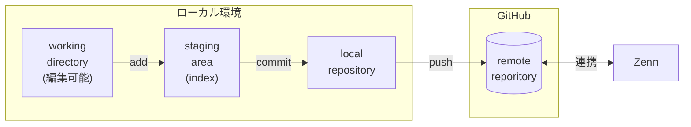

Zenn公式にはGitの詳細に関する記載がないので、それも含めてWindows環境でのZennとGitHubの連携手順メモ。普段GitHub使わない人(私)、WindowsでGit使わん人用。

Markdown記法のファイル(.md)を書いてGitHubに投げれば、自動でZennのサイトに掲載される仕組み。ここではテキストエディタにVisual Studio Codeを使い、そこからGitHubに投げるまでをまとめます。

## メリット
- ブラウザのエディタから開放される。好きなエディタでサッと書ける
- GitHubに版管理を丸投げできる
- Zenn CLIを導入すればブラウザでの見た目をリアルタイムでプレビューできる(便利)
## デメリット
- Zenn CLI、Git、VSCode諸々PC毎にセットアップ必要
- Zenn CLIにはNode.jsのインストール必要。Node.jsは頻繁にバージョン上がるので、人によっては環境競合するかも
- Gitにせよ何にせよWindowsで使うのは~~クソ~~面倒

:::message
手順は変わることもあります。基本は[公式](https://zenn.dev/zenn/articles/connect-to-github)を参照ください。
:::
:::message
Windows環境でLinux出自のgitコマンドとか使うと「\」と「/」がごっちゃになります。ついでに、PowerShellからコマンド入力する手順がありますが、PoweShellで「\」を入力すると`\`と表示されます・・注意が必要なところは補記しています。
:::
## 手順
前提: Win11環境です。
> (お約束)エクスプローラのオプションから「登録されている拡張子は表示しない」チェック外す、「隠しファイル、～を表示」チェック

### Zennのアカウント作成
[Zennのサイト](https://zenn.dev/)でアカウント作成。

### GitHubのアカウント作成
[GitHubのサイト](https://github.co.jp/)でアカウント作成。まずは無償版でOK。
※GitHubでは最近2段階認証が求められるようになってます、スマホにGoogle Authenticatorとかのアプリを入れておきましょう。スマホ用GitHubアプリでもOK。あとはGitHubサイトの指示通りにやればOKです。

### GitHubでリポジトリ作成
GitHubの`Dashboard`から`Top repositories`→`New`でリポジトリ名を入力。
`Public`でも`Private`でもOK。`README`ファイル→不要、`.gitignore`→`None`、`licence`→`None`でOK。

### ZennとGitHubの連携
[公式](https://zenn.dev/zenn/articles/connect-to-github)参照。

### Visual Studio Codeをインストール
Gitのインストール前に入れておくのがおすすめ。[公式](https://azure.microsoft.com/ja-jp/products/visual-studio-code)からダウンロード。
起動したら左側の`拡張機能`から`Japanese Language Pack for Visual Studio Code`、`GitHub Pull Requests`、`Markdown All in One`あたりをダウンロードしておく。

### Gitのインストール
[Gitのサイト](https://git-scm.com/downloads)からダウンロード。
エディタは`Visual Studio Code`を選択
`Override the default branch name for new repositories`が出たら`main`を選んでおく
> BLMとかの関係で`master`は良くないよねって流れ。もうマスタースレーブとか言っちゃいけないって最近知りました。

`Use external OpenSSH`を選択。Windows10からは`OpenSSH`が標準でバンドルされてるので、今回はそっちを利用。Gitとの連携手順は後ろの方を参照。他はそのまま`Next`で大丈夫。
> SSHはGitHubとの暗号通信に必須。ここではRSAの公開鍵方式を使います。

Gitへのパスが通ってるか確認
PowerShellから
```powershell
> git --version
```
バージョン出たらOKなので**Gitの設定**に進む。
(以降の記載でも
```powershell
> コマンド
```
という表記は、全てPowerShellから`コマンド`の部分を実行します)

### もしgitコマンドが認識されなかったら
エラー出たらパス通ってない可能性が高い。Gitの場所を確認して環境変数PATHに追加
```powershell
# エクスプローラかなんかでGitの場所を探してパスに追加。
# (場所はだいたいこのへん) *ここはバックスラッシュです*
> $env:PATH="$($env:PATH);C:\Program Files\Git\cmd"
# ただし、$env:PATHはセッション内限定なので消えてしまう。永続化する場合は
# ユーザ毎の設定:
> [System.Environment]::SetEnvironmentVariable("PATH", "$($env:PATH);C:\Program Files\Git\cmd", [System.EnvironmentVariableTarget]::User)
# PC全体の設定(管理者権限必要):
> [System.Environment]::SetEnvironmentVariable("PATH", "$($env:PATH);C:\Program Files\Git\cmd", [System.EnvironmentVariableTarget]::Machine)
# なんでパス通すのにこんなことなんねん...MSさん訳分からんで
```
または画面からPATH書き換える。(これ普段win使ってないとほんま場所よく忘れる)
`Windows`キー+`X`→`設定`

→システム→バージョン情報

→「デバイスの仕様」の下にくっついてる「システムの詳細設定」

→詳細設定タブ→環境変数

→ユーザかシステムの環境変数からPathを選択して「編集」

→「新規」からGitのパス(`C:\Program Files\Git\cmd`)を追加

(どっちにしても~~クソ~~面倒)

パスを通したらPowerShellを再立ち上げ。これで認識してくれるはず。

### Gitの設定(最初だけ)
```powershell
> git config --global user.name "ユーザ名"       #お決まり
> git config --global user.email "mail@address" #お決まり
> git config --global init.defaultBranch main #masterじゃなくてmainにしようね
```
configのリスト確認方法：
```powershell
> git config list
```
↑でメールアドレスとか設定されてるのを確認
ちなみにWindows版でGit.configファイルの場所は以下の通り。(バージョンによって変わるかも)
```powershell
C:\Program Files\Git\etc\gitconfig  # デフォルト
C:\Users\(ユーザ名)\.gitconfig       # ユーザ毎。メールアドレスとかはここに入るはず
(リポジトリフォルダ)\.git\config      # リポジトリ固有
```

### GitHubにSSHキー登録
まず鍵作る。パスフレーズは省略できる(が非推奨)。鍵は接続先毎に変えておきたいのでファイル名を明示する。
```powershell
# Windows環境でssh-keygenを使うときは、'~/'を解釈してくれないので代わりに$HOMEを使う
# $HOMEはC:\Users\(ユーザ名)に相当する
> ssh-keygen -t rsa -b 4096 -C "自分のmail@address" -f $HOME\.ssh\id_rsa_github
Enter passphrase (empty for no passphrase): #任意のパスフレーズを入力(覚えておく)
Enter same passphrase again: #もっかい入力
```

```powershell
# もし作成済の鍵と名前が被ったら
Generating public/private rsa key pair.
C:\Users\(ユーザ名)\.ssh\id_rsa_github already exists.
Overwrite (y/n)?
# と聞かれる。 GitHubへの鍵登録が済んでいればこの手順はパス。
```

これで秘密鍵と公開鍵ができるので、公開鍵をGitHubに登録。公開鍵の場所は
```powershell
C:\Users\(ユーザ名)\.ssh\id_rsa_github.pub
```
エクスプローラだと`PC`→`Windows(C:)`→`ユーザー`→(ユーザ名)→`.ssh`で辿れる。

`id_rsa_github.pub`ファイルを適当なテキストエディタで開いて(テキストエディタを入れてなければ「メモ帳」を開いて`id_rsa_github.pub`ファイルをドラッグ&ドロップすればOK)、「中身の`ssh-rsa ～～～`のテキスト」を丸ごとコピー。
GitHubのサイトから右上のアイコン→`Settings`→`SSH and GPG keys`→`New SSH key`で`Key`にコピーしたテキストをそのまま貼り付け→`Add SSH key`

### OpenSSHエージェントサービスの有効化
WindowsのOpenSSHサービスは通常停止しているので、それを有効化する。前準備が必要。

1.  .ssh\configファイルを作成
    `C:\Users\(ユーザ名)\.ssh`フォルダ(さっきと同じ場所)に`config`という名前のファイルを作成する。(拡張子なし。テキストファイルを作成→拡張子を削除)
    適当なテキストエディタで開いて(拡張子削るとメモ帳では開けないのでファイルをドラッグ&ドロップ)、以下の内容をこのまんま貼り付ける。
    ```powershell:config
    Host github.com
      HostName github.com
      User git
      IdentityFile ~/.ssh/id_rsa_github
      AddKeysToAgent yes
    ```

    |configの記述|意味|
    |---|---|
    |Host|SSH接続時の名前(エイリアス)。`github.com`の代わりに`gh`にすると、SSH接続を`ssh gh`みたいに書ける|
    |HostName|リモートホストの指定。IPアドレスでもOK|
    |User|SSH接続のユーザ名。GitHubは`git`ユーザで接続する決まりなので、変えると接続できない|
    |IdentityFile|さっき作った鍵の片割れ(秘密鍵のほう)を指定。パスは\じゃなくて/なので注意。ちなみにWindows環境での`~/`は`C:\Users\(ユーザ名)\`を意味する|
    |AddKeysToAgent|yesを指定するとOpenSSHエージェント(この下の手順で起動するサービス)がSSHキーを覚えてくれる。パスフレーズも記憶してくれるが、パスフレーズはメモリ上に持つだけなので再起動後はまた聞かれる|

2.  OpenSSH Authentication Agentを起動
    Windowsの`スタート`→`Windowsツール`→`サービス`を開く
    `OpenSSH Authentication Agent`を探して、`スタートアップの種類`を`自動`にして`適用`
    さらに`開始`でサービスを立ち上げる。
    

3.  SSHの起動・動作確認
    ```powershell
    > Get-Service ssh-agent
    # サービスが起動しているとこんな感じになる
    Status   Name               DisplayName
    ------   ----               -----------
    Running  ssh-agent          OpenSSH Authentication Agent
    # SSHエージェントが機能していることのチェック
    > ssh -T git@github.com
    The authenticity of host 'github.com (xx.xx.xx.xx)' cant be established.
    ED25519 key fingerprint is SHA256:～～.
    This key is not known by any other names.
    # 初めてつなぐ先だよ、という警告。yesと回答
    Are you sure you want to continue connecting (yes/no/[fingerprint])? yes
    # 既知のホストとして登録されたよ
    Warning: Permanently added 'github.com' (ED25519) to the list of known hosts.
    # 最初はパスフレーズを聞かれるので入力
    Enter passphrase for key 'C:\Users\(ユーザ名)/.ssh/id_rsa_github':
    # これが出たらSSH接続成功
    Hi (ユーザ名)! You ve successfully authenticated, but GitHub does not provide shell access.
    > ssh -T git@github.com
    # うまく設定できていれば、2回目はパスフレーズを聞かれない
    Hi (ユーザ名)! You ve successfully authenticated, but GitHub does not provide shell access.
    ```

4.  GitがOpenSSHクライアントを使うように設定
    さっきインストールしたGitがOpenSSHを使えるように設定する。
    ```powershell
    # 明示的にWIndowsのSSHサービスを使うように設定 *ここは\じゃなくて/なのに注意*
    > git config --global core.sshCommand "C:/Windows/System32/OpenSSH/ssh.exe"
    ```

### 記事を管理するフォルダを作成
**Zennの記事管理に使うフォルダ**を作成。このフォルダは同時に**Zenn CLIのためのNode.jsプロジェクトフォルダ**で、**Gitのローカルリポジトリ**にもなる。(ここでは`D:\Zenn`とする。エクスプローラで作ってもOK)
```powershell
> mkdir D:\Zenn
# ちなみにmkdirはPowerShellのコマンドレットNew-Itemのエイリアス。
# PowerShell的に書くと
> New-Item -Path "D:\Zenn" -ItemType Directory
# になるらしい。無理やり古のDOS窓に似た動きにしてくれてるだけ。
# インターネッツ老人会のオッサンは非常に混乱する。
```


> オーソドックスに`ドキュメント`フォルダに作ってもOK。
  その場合パスが`C:\Users\私の 名前\Documents\Zenn`みたいになるが問題ない。
```powershell
> cd ~\Documents\Zenn
# これで"C:\Users\私の 名前\Documents\Zenn"に移動できる。
# これを知るまでドキュメソトフォルダは絶対使わなかった。ちなみに
> cd ~/Documents/Zenn
# \じゃなくて/でも普通に動く。これもうわかんねぇな
```

### Node.jsをインストール
[公式サイト](https://nodejs.org/)参照
セットアップ画面の中で、`Automatically install the necessary tools. ～`はチェックしなくてOK。

### Zenn CLIをインストール
[公式サイト](https://zenn.dev/zenn/articles/install-zenn-cli)参照。このとき、**作成済のZenn用フォルダ**で実行する。
```powershell
> cd D:\Zenn\
> npm init --yes # プロジェクトをデフォルト設定で初期化
> npm install zenn-cli # zenn-cliを導入
> npx zenn init
```
これで`D:\Zenn\articles`フォルダが作成される。
> もし`npm`や`npx`が認識されない場合は、Gitのときと同様に`PATH`を設定する。(だいたい`C:\Program Files\nodejs\`)

### Gitのローカルリポジトリ作成
これも**作成済のZenn用フォルダ**で実行。
```powershell
> cd D:\Zenn
> git init
```
これで`Zenn`フォルダの中に隠しフォルダ`.git`が作成され、`Zenn`フォルダがGitのローカルリポジトリとして機能するようになる。以降は`.git`フォルダの中身以外は全てGitの管理下になる。
> `Zenn`フォルダの中を見ると`node_modules`フォルダに大量のファイルが作られてるが、これらは`.gitignore`ファイルで無視されるよう設定されてるので、気にしなくて大丈夫。

リポジトリが機能しているかどうかは、`git init`を実行したフォルダで
```powershell
> git status
```
で確認できる。リポジトリでなければ
```powershell
fatal: not a git repository (or any of the parent directories): .git
```
のように怒られる。
ちなみに、隠しフォルダ`.git`を削除すればGitのローカルリポジトリは完全に消滅する。

### GitのローカルリポジトリとGitHubのリポジトリを紐付け
GitHubのサイトを開き、前に作成したリポジトリの画面に移動。
SSHのリモートアドレス(`git@github.com:～～/～～.git`)が表示されてるので、それをコピー。
(既に何かのファイルをpushした状態なら、`Code`を開けば出てくる)
```powershell
> git remote add origin git@github.com:～～/～～.git
# originはGitHubのリポジトリ名に対する別名。originでなくてもいいがお決まり。
```
これでローカルリポジトリとGitHubが連携する。紐付けの状態は
```powershell
> git remote -v
origin  git@github.com:～～/～～.git (fetch)
origin  git@github.com:～～/～～.git (push)
```
のように確認できる。

### Markdown形式で記事の作成
[公式](https://zenn.dev/zenn/articles/zenn-cli-guide)参照。ただし、公式の
```powershell
> npx zenn new:article
```
だとファイル名([slug](https://zenn.dev/zenn/articles/what-is-slug))がランダムに生成されるため、
```powershell
> npx zenn new:article --slug file-name-of-text
```
のようにslugだけは指定したほうがいい。(英数・ハイフン・アンスコ12〜50文字)
Visual Studio Codeから`ファイル`→`フォルダーを開く`で`Zenn`フォルダーを開いて、`article`フォルダの下にできた.mdファイルを更新していく。
Markdown記法は[公式](https://zenn.dev/zenn/articles/markdown-guide)参照。

### プレビューの起動
[公式](https://zenn.dev/zenn/articles/zenn-cli-guide)参照。
```powershell
# これもZennフォルダで
> npx zenn preview
```
ブラウザで`http://localhost:8000`を開くと、.mdファイルを更新する度にプレビューも更新されていく。便利。
これを実行しているPowreShellの窓を閉じると、プレビュー機能も停止するので注意。また、以降もgit関係の操作をPowerShellで行う場合、別のPowerShellウィンドウを開く。(同じように`Zenn`フォルダに`cd`しておく)

### Gitのステージング・コミット・プッシュ（記事の公開）
> ↓普段Git使わない人向け

Gitにはステージングという構造がある。

> VSCodeで編集してる.mdファイルがいる場所はワーキングディレクトリ・作業ツリーと呼ばれ、そこからステージングエリアに移動(`add`)させてからローカルリポジトリにコミット(`commit`)する(必要なファイルだけコミットしたり、競合を解決する仕組み。ステージングはファイルや行単位、コミットはまとめて、のイメージ)。そこから更に`push`してGitHubに辿り着く。`.md`ファイルの編集くらいならファイル単位でボコボコ`add`して`commit`して`push`すればOK。

ファイルをステージングエリアに移動：
```powershell
> cd D:\Zenn\                       #まずZennフォルダに移動
> git add .\articles\(ファイル名).md #特定のファイルをステージング
> git add .\articles\               #articles内の全ファイルをステージング
> git add .                         #Zennフォルダ下にある全ファイルをステージング
```
または、Visual Studio Codeで~~GitHub Pull Requestsを導入していれば~~(←なくてもOKだった)、`ソース管理`から変更したファイルの`+`マークでステージングできる。

ステージングが完了したら、ローカルリポジトリにコミットする。
```powershell
> git commit -m "何を変更したかメモ"
```
またはVS Codeから

これでローカルリポジトリが更新されたが、まだGitHubには反映されていない。まず`.md`ファイルの`published: false`で非公開状態にして試すのがオススメ。
```powershell
# 最初は-uオプションでローカルリポジトリのmainとGitHubのリモートリポジトリを紐づける。
> git push -u origin main
# 一度-uオプション指定すれば、次からは
> git push
# だけでOK。
```

VS Codeの`変更の同期`でも同じ操作になる。

`git push -u`してない状態でVS Codeから`変更の同期`しようとすると、以下のように聞かれる。`今後は表示しない`でOK。

これで[Zenn](https://zenn.dev/)のサイトに移動し、自分のアカウントから「記事の管理」で下書き状態が見れるようになったらOK。`published: true`に変更してステージング→コミット→再プッシュして完了。
> Zennのサイト上でも記事を更新できるが、Gitで再pushすると上書きされる

VS Codeでは、GitHubのリポジトリがローカルリポジトリを追いかけてる様子が見れる。


> 他にも[GitHub Desktop](https://github.com/apps/desktop)などGUIツールがいくつかあるので、好みのを使ってみてください。
  個人で書く分には、Gitに関しては上図の一方通行で十分だと思います。(別のPCでも記事を更新するときは、pullリクエストや競合の解決とか必要になってくるので、詳細はそのうち別記事に書きます)