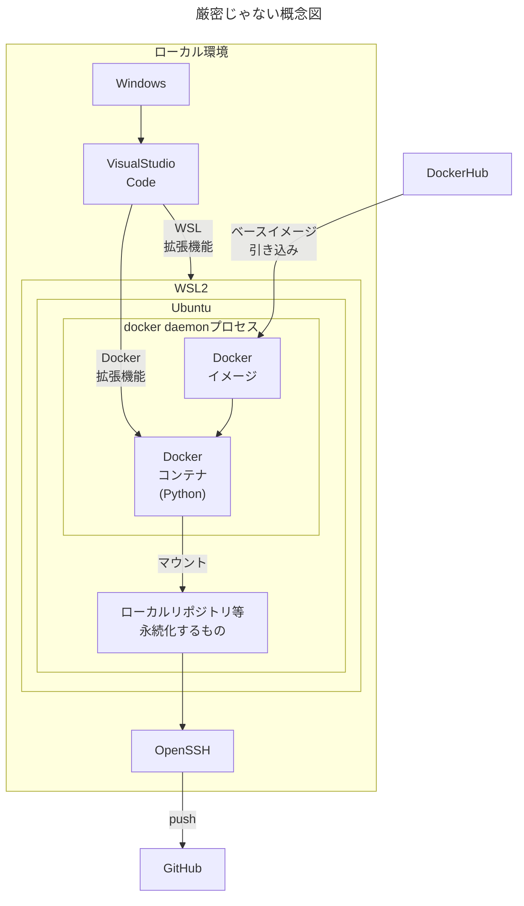
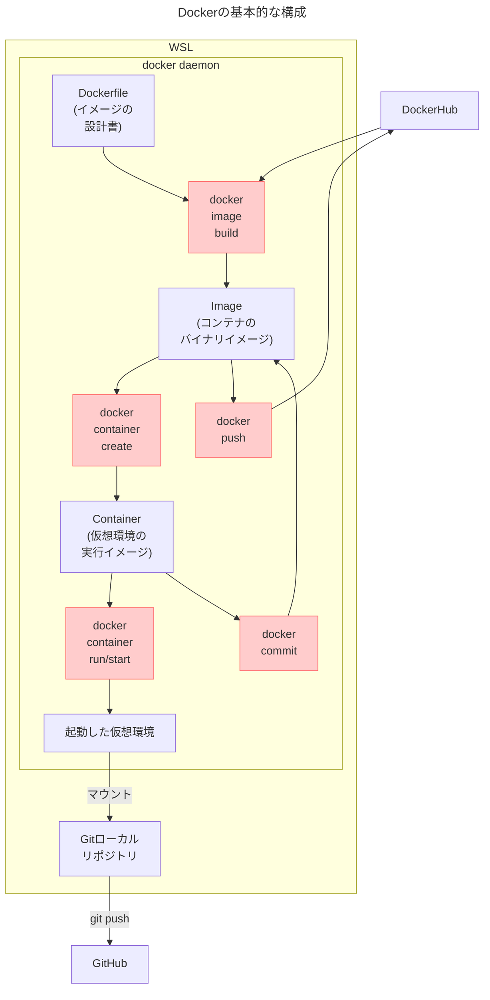
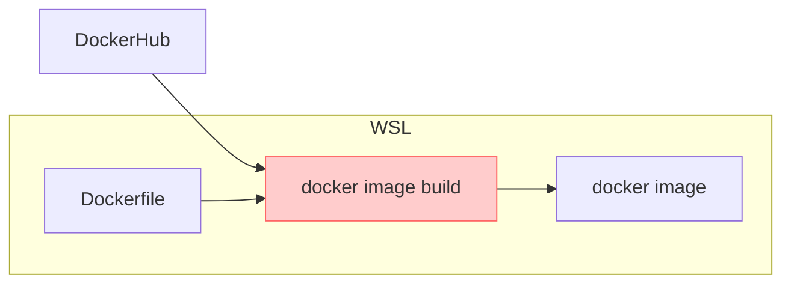
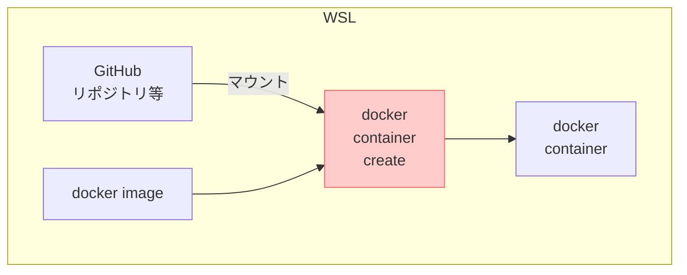

Windows環境でWSL上のUbuntuにDocker入れて、コンテナ立ち上げてGitHubにつないでPythonをVSCodeで書いて、GPUを使って動かすところまでの手順メモ。[WSLの設定とUbuntu導入は別記事](https://zenn.dev/tabirider/articles/setup-wsl-ubuntu)。

:::message
`PowerShell`と`WSL-Ubuntu`と`Docker`コンテナ内が混じるので、
`>`→PowerShell
`$`→WSLのUbuntu
`#`→Dockerコンテナ
:::

## 環境の概要

- WSL上の中のUbuntuの中のDockerコンテナの中でPythonを実行
- GitのローカルリポジトリはWSL上に作成しコンテナからマウント
- Visual Studio CodeでWSL、DockerコンテナにアタッチしPython書いたりデバッグ
- SSHはWindows上のOpenSSHを使用



## Visual Studio Code導入

[公式](https://azure.microsoft.com/ja-jp/products/visual-studio-code)から。
導入後、左の拡張機能アイコンから`Japanese Language Pack`, `WSL`, `Dev Containers`, `Docker`あたりをインストール。`Python`関連の拡張機能はここでは不要。

### VSCodeをroot権限で実行する方法
WSLにrootで入り、シェルからVSCodeを実行すればOK。
```shell-session:WSL
> #rootでWSLを起動
> wsl -u root
$ #codeでVSCodeが起動
$ code .
```

## GitHubアカウント作成
[GitHubのサイト](https://github.co.jp/)でアカウント作成。まずは無償版でOK。
※GitHubでは2段階認証が求められる。スマホにGoogle Authenticatorとかスマホ用GitHubアプリ入れて、あとはGitHubサイトの指示通りにやればOK。

## GitHub連携用のSSH設定

WSLからのGitHub接続等に、Windows10以降に標準でバンドルされているOpenSSHを使う。(WSLはデフォルトで[Windowsサービスの相互運用](https://zenn.dev/tabirider/articles/setup-wsl-ubuntu#%E7%9B%B8%E4%BA%92%E9%81%8B%E7%94%A8%E3%81%AE%E8%A8%AD%E5%AE%9A)がONになってる)

### GitHubにSSHキー登録

GitHub用のSSHキーは**Windows上で作成**。PowerShellで操作。(Windows上でGitHub連携が済んでいればこの手順は省略)
パスフレーズは省略できる(が非推奨)。鍵は接続先毎に変えておきたいのでファイル名を明示する。
```powershell:PowerShell
# Windows環境でssh-keygenを使うときは、'~/'を解釈してくれないので代わりに$HOMEを使う
# $HOMEはC:\Users\(ユーザ名)に相当する
> ssh-keygen -t rsa -b 4096 -C "自分のmail@address" -f $HOME\.ssh\id_rsa_github
Enter passphrase (empty for no passphrase): #任意のパスフレーズを入力(覚えておく)
Enter same passphrase again: #もっかい入力
```

これで秘密鍵と公開鍵ができるので、公開鍵をGitHubに登録。公開鍵の場所は
```powershell
C:\Users\(ユーザ名)\.ssh\id_rsa_github.pub
```
エクスプローラだと`PC`→`Windows(C:)`→`ユーザー`→(ユーザ名)→`.ssh`で辿れる。

`id_rsa_github.pub`ファイルを適当なテキストエディタで開いて(テキストエディタを入れてなければ「メモ帳」を開いて`id_rsa_github.pub`ファイルをドラッグ&ドロップすればOK)、「中身の`ssh-rsa ～～～`のテキスト」を丸ごとコピー。
GitHubのサイトから右上のアイコン→`Settings`→`SSH and GPG keys`→`New SSH key`で`Title`をPC名とかにしておいて、`Key`にコピーしたテキストをそのまま貼り付け→`Add SSH key`。2段階認証かけてたらスマホから承認。

### OpenSSHエージェントサービスの有効化
WindowsのOpenSSHサービスは通常停止しているので、それを有効化する。前準備が必要。

1.  .ssh\configファイルを作成
    `C:\Users\(ユーザ名)\.ssh`フォルダ(さっきと同じ場所)に`config`という名前のファイルを作成する。(拡張子なし。テキストファイルを作成→拡張子を削除)
    適当なテキストエディタで開いて(拡張子削るとメモ帳では開けないのでファイルをドラッグ&ドロップ)、以下の内容をこのまんま貼り付ける。
    ```powershell:config
    Host github.com
      HostName github.com
      User git
      IdentityFile ~/.ssh/id_rsa_github
      AddKeysToAgent yes
    ```

    |configの記述|意味|
    |---|---|
    |Host|SSH接続時の名前(エイリアス)。`github.com`の代わりに`gh`にすると、SSH接続を`ssh gh`みたいに書ける|
    |HostName|リモートホストの指定。IPアドレスでもOK|
    |User|SSH接続のユーザ名。GitHubは`git`ユーザで接続する決まりなので、変えると接続できない|
    |IdentityFile|さっき作った鍵の片割れ(秘密鍵のほう)を指定。パスは\じゃなくて/なので注意。ちなみにWindows環境での`~/`は`C:\Users\(ユーザ名)\`を意味する|
    |AddKeysToAgent|yesを指定するとOpenSSHエージェント(この下の手順で起動するサービス)がSSHキーを覚えてくれる。パスフレーズも記憶してくれるが、パスフレーズはメモリ上に持つだけなので再起動後はまた聞かれる|

2.  OpenSSH Authentication Agentを起動
    Windowsの`スタート`→`Windowsツール`→`サービス`を開く
    `OpenSSH Authentication Agent`を探して、`スタートアップの種類`を`自動`にして`適用`
    さらに`開始`でサービスを立ち上げる。
    

3.  SSHの起動・動作確認
    PowerShellで。
    ```powershell:PowerShell
    > Get-Service ssh-agent
    # サービスが起動しているとこんな感じになる
    Status   Name               DisplayName
    ------   ----               -----------
    Running  ssh-agent          OpenSSH Authentication Agent
    # SSHエージェントが機能していることのチェック
    > ssh -T git@github.com
    The authenticity of host 'github.com (xx.xx.xx.xx)' cant be established.
    ED25519 key fingerprint is SHA256:～～.
    This key is not known by any other names.
    # 初めてつなぐ先だよ、という警告。yesと回答
    Are you sure you want to continue connecting (yes/no/[fingerprint])? yes
    # 既知のホストとして登録されたよ
    Warning: Permanently added 'github.com' (ED25519) to the list of known hosts.
    # 最初はパスフレーズを聞かれるので入力
    Enter passphrase for key 'C:\Users\(ユーザ名)/.ssh/id_rsa_github':
    # これが出たらSSH接続成功
    Hi (ユーザ名)! You ve successfully authenticated, but GitHub does not provide shell access.
    > ssh -T git@github.com
    # うまく設定できていれば、2回目はパスフレーズを聞かれない
    Hi (ユーザ名)! You ve successfully authenticated, but GitHub does not provide shell access.
    ```

## WSLの設定

PowerShellからWSLに入る。
```powershell:PowerShell
# Ubuntuにログイン
> wsl -d ubuntu
# -d省略したら既定distroに入る
> wsl
```
ログインしたら、カレントディレクトリがWindowsドキュメントフォルダになってる。気持ち悪いけどこの挙動を変える方法は見当たらない。とりあえずホームに移動。
```shell-session:WSL
name@machine:/mnt/c/Users/私の 名前$ cd ~
```

なおWSLは既定値でPATHにWindowsパスを追加するようになってる。
```shell-session:WSL
$ echo $PATH #うわあぁあ
/usr/local/sbin:/usr/local/bin:/usr/sbin:/usr/bin:/sbin:/bin:/usr/g
ames:/usr/local/games:/usr/lib/wsl/lib:/mnt/c/Python312/Scripts/:/m
nt/c/Python312/:/mnt/c/Windows/system32:/mnt/c/Windows:/mnt/c/Windo
ws/System32/Wbem:/mnt/c/Windows/System32/WindowsPowerShell/v1.0/:～
```
これで**シェルからWindowsのプログラムを叩ける**。うーん
```shell-session:WSL
$ calc.exe #Windowsの電卓が出る
```

### systemdの有効化

[公式](https://learn.microsoft.com/ja-jp/windows/wsl/systemd#how-to-enable-systemd)だと`Ubuntu`は`systemd`の利用が規定値になったらしい。念のため確認。
`systemd`が動いてないと[systemctl](https://ja.ubunlog.com/systemctl-trabaja-servicios-terminal/)も[microk8s](https://microk8s.io/)も動かない。[systemdの詳細は公式](https://learn.microsoft.com/ja-jp/windows/wsl/systemd)。
以下のように`wsl.conf`が設定されていればOKなので次の手順に。
```shell-session:WSL
$ cat /etc/wsl.conf
[boot]
systemd=true
```
ファイルがなければ作成して上の内容を追記。
```shell-session
$ sudo nano /etc/wsl.conf
```
```
[boot]
systemd=true
```
`Ctrl`+`O` → `Enter` → `Ctrl` + `X`で保存して終了。いったんWSLを抜けて再起動する。
```shell-session:WSL
$ exit
```
```powershell:PowerShell
> wsl --shutdown #WSLの全distroを停止
> wsl -l --verbose #distroの稼動状態
  NAME      STATE           VERSION
* Ubuntu    Stopped         2　       #止まってる
> wsl -d ubuntu #再起動
```

## Docker導入

```shell-session:WSL
$ #おきまり
$ sudo apt update
$ #おきまり
$ sudo apt upgrade
$ # リポジトリとHTTPS通信の準備
$ sudo apt install -y ca-certificates curl gnupg lsb-release
$ # DockerのGPGキーを取得して登録
$ mkdir -p /etc/apt/keyrings
$ curl -fsSL https://download.docker.com/linux/ubuntu/gpg | sudo gpg --dearmor -o /etc/apt/keyrings/docker.gpg
$ # リポジトリ設定
$ echo "deb [arch=$(dpkg --print-architecture) signed-by=/etc/apt/keyrings/docker.gpg] https://download.docker.com/linux/ubuntu $(lsb_release -cs) stable" | sudo tee /etc/apt/sources.list.d/docker.list > /dev/null
$ sudo apt update
$ # Docker関係のインストール(今回は無償版のcommunity edition)
$ sudo apt install -y docker-ce docker-ce-cli containerd.io docker-buildx-plugin docker-compose-plugin
$ # バージョン確認
$ docker version
Client: Docker Engine - Community
 Version:           27.4.1
～～
$ # dockerグループに追加
$ sudo usermod -aG docker $USER
$ newgrp docker
$ groups
$ # グループにdocker追加を確認
docker adm dialout ～～
```

## Git設定・ローカルリポジトリ作成

### Gitの設定

```shell-session:WSL
$ git config --global user.name "ユーザ名"         #おきまり
$ git config --global user.email "メール@アドレス" #おきまり
$ git config --global init.defaultBranch main     #masterじゃなくてmainにしようね
$ #WindowsのOpenSSHサービスを使う味わい深い設定(ここは/)
$ git config --global core.sshCommand "/mnt/c/Windows/System32/OpenSSH/ssh.exe"
$ git config -l                                   #設定内容の確認
user.name=ユーザ名
user.email=メール@アドレス
init.defaultbranch=main
core.sshcommand=/mnt/c/Windows/System32/OpenSSH/ssh.exe
$ cat ~/.gitconfig                                #configの場所はここ
[user]
        name = ユーザ名
        email = メール@アドレス
[init]
        defaultBranch = main
[core]
        sshCommand = /mnt/c/Windows/System32/OpenSSH/ssh.exe
```

### Gitローカルリポジトリの作成

とりあえずhomeに作成。

```shell-session:WSL
$ cd ~
$ mkdir python_sandbox
$ cd python_sandbox/
$ git init #これでpython_sandboxがGitのローカルリポジトリになる
Initialized empty Git repository in /home/takak/python_sandbox/.git/
$ git status
On branch main
No commits yet
nothing to commit (create/copy files and use "git add" to track)
```
### ローカルリポジトリとGitHubリポジトリの連携

GitHubのサイトで、作成済のリポジトリに移動してSSHのアドレスをコピー。

```shell-session:WSL
$ git remote add origin git@github.com:～～/～～.git #コピーしたアドレス
$ git remote -v
origin  git@github.com:～～/～～.git (fetch)
origin  git@github.com:～～/～～.git (push)
```
これでローカルからGitHubにpushする準備は完了。

## Visual Studio CodeからWSLに接続

`Visual Studio Code`に`WSL`拡張機能を導入すると、左下の`リモート ウィンドウ`から`WSL への接続`を選択できる。


または`Ctrl`+`Shift`+`P`で`wsl`を入力。


あとは`ファイル(F)`→`フォルダーを開く(F)`でディレクトリを指定すれば、WSL上のファイルを直接編集できる。

## Docker仮想環境の立ち上げ

[DockerHub](https://hub.docker.com/)にPythonやnginx、PostgreSQL等のイメージがアップされていて、イメージを引っ張るだけでたいがいの環境を作れる。流れはこんな感じ。




### Dockerfileの準備
VSCodeで`/home/(ユーザ名)/python_sandbox/`を開き、新規ファイルで`Dockerfile`を作成。
```dockerfile:Dockerfile
# Python Dockerイメージをベースに利用
FROM python:3.13.1-slim

# 例としてNumPyのインストール
RUN apt update && apt upgrade -y && \
    apt-get clean && rm -rf /var/lib/apt/lists/* && \
    pip install --no-cache-dir numpy

# 作業ディレクトリの設定
WORKDIR /app

# デフォルトの実行コマンド
CMD ["bash"]
```

### dockerイメージファイルの作成



```shell-session:WSL
$ #作業用ディレクトリで実施
$ cd ~/python_sandbox
$
$ #イメージビルド(Dockerfileを指定)
$ docker image build -t python_sandbox -f Dockerfile .
$
$ #構築されたイメージを確認
$ docker image ls
REPOSITORY       TAG       IMAGE ID       CREATED              SIZE
python_sandbox   latest    cde776287f5d   About a minute ago   195MB

$ #Dockerfileは省略してもいい(デフォ値がDockerfileになっているため)
$ docker image build -t python_sandbox .
```

### Dockerコンテナの作成



```shell-session:WSL
$ #コンテナ作成(appに作業用ディレクトリをマウント)
$ docker container create -t --name python_sandbox -v ~/python_sandbox:/app python_sandbox

$ #作ったコンテナを確認
$ docker container ls -a
CONTAINER ID   IMAGE            COMMAND   CREATED          STATUS    PORTS     NAMES
e814e2f6cf88   python_sandbox   "bash"    26 seconds ago   Created             python_sandbox
```

### Dockerコンテナの起動

```shell-session:WSL
$ #コンテナを起動
$ docker container start python_sandbox
python_sandbox

$ #起動しているか確認(-aオプションを指定しないと、停止中のコンテナは表示されない)
$ docker container ls -a
CONTAINER ID   IMAGE            COMMAND   CREATED              STATUS         PORTS     NAMES
e814e2f6cf88   python_sandbox   "bash"    About a minute ago   Up 7 seconds             python_sandbox

$ #起動しているコンテナに入る(デフォルトではrootで入るようになっている)
$ docker container exec -it python_sandbox bash

# #OS確認
# cat /etc/os-release
# #PythonのベースイメージはDebianらしい
PRETTY_NAME="Debian GNU/Linux 12 (bookworm)"
NAME="Debian GNU/Linux"
VERSION_ID="12"
～～

# #カーネル確認→WSLと同じ(共有している)
# cat /proc/version
Linux version 5.15.167.4-microsoft-standard-WSL2 (root@f9c826d3017f) (gcc (GCC) 11.2.0, GNU ld (GNU Binutils) 2.37) #1 SMP Tue Nov 5 00:21:55 UTC 2024
# exit
exit
```
コンテナは起動したとき、やることがないと一瞬で落ちる。このため`Dockerfile`で`CMD ["bash"]`を指定している。
Visual Studio CodeでWSLに入っていると、`Docker`拡張機能でイメージ・コンテナをVSCodeの画面から確認できる。


### Visual Studio CodeからDockerコンテナに接続

Visual Studio Codeの拡張機能`Dev Containers`を有効にしていると、左下`><`から`実行中のコンテナにアタッチ`が選択できる。

これで実行中のコンテナに接続すると、VSCodeから直接コードの編集ができる。
この状態で`Python`拡張機能を導入。

Python関係の拡張機能はコンテナ内に導入される。VSCodeの拡張機能は接続先によって導入場所が変わる。`フォルダーを開く`で`/app`を開きファイルを作成。これでPythonのデバッグ環境が完成。

### Dockerコンテナの停止

```shell-session:WSL
$ #コンテナを停止
$ docker container stop python_sandbox
python_sandbox

$ #停止していることを確認
$ docker container ls -a
CONTAINER ID   IMAGE            COMMAND   CREATED          STATUS                       PORTS     NAMES
e814e2f6cf88   python_sandbox   "bash"    16 minutes ago   Exited (137) 4 seconds ago             python_sandbox    ```
```
`container stop`しても、VSCodeとかが勝手に再起動したりする。

### Dockerコンテナの削除

```shell-session:WSL
$ #コンテナを確認
$ docker container ls -a
CONTAINER ID   IMAGE            COMMAND       CREATED        STATUS                        PORTS     NAMES
14e47b3add39   python_sandbox   "/bin/bash"   10 hours ago   Exited (137) 11 seconds ago             python_sandbox

$ #コンテナを削除
$ docker container rm python_sandbox
python_sandbox

$ docker container ls -a
$ #消えている
CONTAINER ID   IMAGE     COMMAND   CREATED   STATUS    PORTS     NAMES

$ #CONTAINER IDの先頭数文字(コンテナを識別できる範囲)指定でもOK
$ docker container rm 14e4
```

### Dockerイメージの削除

```shell-session:WSL
$ #イメージの確認
$ docker image ls -a
REPOSITORY       TAG       IMAGE ID       CREATED        SIZE
python_sandbox   latest    b99460de47d9   10 hours ago   195MB

$ #イメージの削除
$ docker image rm python_sandbox
Untagged: python_sandbox:latest
Deleted: sha256:b994～
```

## DockerコンテナでのGPU利用設定

WSL上のDockerコンテナでGPUを利用できる。

### 条件

- `Win10 21H2`, `Win11`で`WSL2`
- NVIDIA製GPUのみ
- NVIDIAドライバ510以降が必要
- `Docker`の`nvidia-container-toolkit`を導入

### NVIDIAドライバインストール

念のため[NVIDIAのサイト](https://www.nvidia.com/en-us/drivers/)から最新ドライバを導入。

> [**This is the only driver you need to install. Do not install any Linux display driver in WSL.**](https://docs.nvidia.com/cuda/wsl-user-guide/index.html#step-1-install-nvidia-driver-for-gpu-support)

他のドライバ入れちゃダメ。
ドライバのバージョンはPowerShellから確認できる。

```
> nvidia-smi
+-----------------------------------------------------------------------------------------+
| NVIDIA-SMI 566.36                 Driver Version: 566.36         CUDA Version: 12.7     |
|-----------------------------------------+------------------------+----------------------+
| GPU  Name                  Driver-Model | Bus-Id          Disp.A | Volatile Uncorr. ECC |
| Fan  Temp   Perf          Pwr:Usage/Cap |           Memory-Usage | GPU-Util  Compute M. |
|                                         |                        |               MIG M. |
|=========================================+========================+======================|
|   0  NVIDIA GeForce RTX 3060 Ti   WDDM  |   00000000:01:00.0  On |                  N/A |
|  0%   41C    P8             12W /  200W |     970MiB /   8192MiB |      4%      Default |
|                                         |                        |                  N/A |
+-----------------------------------------+------------------------+----------------------+

+-----------------------------------------------------------------------------------------+
| Processes:                                                                              |
|  GPU   GI   CI        PID   Type   Process name                              GPU Memory |
|        ID   ID                                                               Usage      |
|=========================================================================================|
|    0   N/A  N/A      3160    C+G   ...\cef\cef.win7x64\steamwebhelper.exe      N/A      |
～～
```

### CUDAサポートツール導入

CUDA(Compute Unified Device Architecture)ツールを導入。詳細は[NVIDIAのCUDAページ](https://docs.nvidia.com/cuda/wsl-user-guide/index.html)。

> The CUDA driver installed on Windows host will be stubbed inside the WSL 2 as `libcuda.so`, therefore **users must not install any NVIDIA GPU Linux driver within WSL 2**. One has to be very careful here as the default CUDA Toolkit comes packaged with a driver, and it is **easy to overwrite the WSL 2 NVIDIA driver with the default installation**.

Linux用のCUDA入れると**ドライバが上書きされちゃう**からダメ。

> We recommend developers to use a separate CUDA Toolkit for WSL 2 (Ubuntu) available from the `CUDA Toolkit Downloads` page to avoid this overwriting.

WSL2専用品を用意してるから使ってね。NVIDIAの[CUDA Toolkit](https://developer.nvidia.com/cuda-downloads?target_os=Linux&target_arch=x86_64&Distribution=WSL-Ubuntu&target_version=2.0&target_type=deb_local)から


サイトの手順通り導入

```shell-session:WSL
$ wget https://developer.download.nvidia.com/compute/cuda/repos/wsl-ubuntu/x86_64/cuda-wsl-ubuntu.pin
$ wget https://developer.download.nvidia.com/compute/cuda/repos/wsl-ubuntu/x86_64/cuda-wsl-ubuntu.pin
$ sudo mv cuda-wsl-ubuntu.pin /etc/apt/preferences.d/cuda-repository-pin-600
$ wget https://developer.download.nvidia.com/compute/cuda/12.6.3/local_installers/cuda-repo-wsl-ubuntu-12-6-local_12.6.3-1_amd64.deb
$ sudo dpkg -i cuda-repo-wsl-ubuntu-12-6-local_12.6.3-1_amd64.deb
$ sudo cp /var/cuda-repo-wsl-ubuntu-12-6-local/cuda-*-keyring.gpg /usr/share/keyrings/
$ sudo apt-get update
$ sudo apt-get -y install cuda-toolkit-12-6
```

### NVIDIA Container Toolkitのインストール

[NVIDIAのサイト](https://docs.nvidia.com/datacenter/cloud-native/)参照。`Kubernetes`と`Docker`で違うので注意。コンテナ上でGPUが使えるようになる。

[公式インストールガイド](https://docs.nvidia.com/datacenter/cloud-native/container-toolkit/latest/install-guide.html)に沿って導入。
```shell-session:WSL
$ curl -fsSL https://nvidia.github.io/libnvidia-container/gpgkey | \
  sudo gpg --dearmor -o /usr/share/keyrings/nvidia-container-toolkit-keyring.gpg \
  && curl -s -L https://nvidia.github.io/libnvidia-container/stable/deb/nvidia-container-toolkit.list | \
  sed 's#deb https://#deb [signed-by=/usr/share/keyrings/nvidia-container-toolkit-keyring.gpg] https://#g' | \
  sudo tee /etc/apt/sources.list.d/nvidia-container-toolkit.list
$ sudo apt-get update
$ sudo apt-get install -y nvidia-container-toolkit
```

DockerがNVIDIA Container Runtimeを使うように設定。
```shell-session:WSL
$ sudo nvidia-ctk runtime configure --runtime=docker
```
これは`/cat/docker/daemon.json`を更新してるだけ
```shell-session:WSL
$ cat /etc/docker/daemon.json
{
    "runtimes": {
        "nvidia": {
            "args": [],
            "path": "nvidia-container-runtime"
        }
    }
}
```

### NVIDIAランタイムを使うコンテナを作成

```shell-session:WSL
$ #ランタイムにNVIDIAを指定し、GPUを利用する設定のコンテナを作成
$ docker container create -t --name python_sandbox -v ~/python_sandbox:/app \
  --runtime=nvidia --gpus all python_sandbox
$ #コンテナ立ち上げ
$ docker container start python_sandbox
$ #コンテナに入る
$ docker container exec -it python_sandbox bash
$ #NVIDIAのGPUが認識されているのを確認
# nvidia-smi
Thu Jan  9 05:48:31 2025
+-----------------------------------------------------------------------------------------+
| NVIDIA-SMI 565.77.01              Driver Version: 566.36         CUDA Version: 12.7     |
|-----------------------------------------+------------------------+----------------------+
| GPU  Name                 Persistence-M | Bus-Id          Disp.A | Volatile Uncorr. ECC |
| Fan  Temp   Perf          Pwr:Usage/Cap |           Memory-Usage | GPU-Util  Compute M. |
|                                         |                        |               MIG M. |
|=========================================+========================+======================|
|   0  NVIDIA GeForce RTX 3060 Ti     On  |   00000000:01:00.0  On |                  N/A |
|  0%   39C    P8             11W /  200W |    1217MiB /   8192MiB |      2%      Default |
|                                         |                        |                  N/A |
+-----------------------------------------+------------------------+----------------------+

+-----------------------------------------------------------------------------------------+
| Processes:                                                                              |
|  GPU   GI   CI        PID   Type   Process name                              GPU Memory |
|        ID   ID                                                               Usage      |
|=========================================================================================|
|    0   N/A  N/A        33      G   /Xwayland                                   N/A      |
+-----------------------------------------------------------------------------------------+
```
