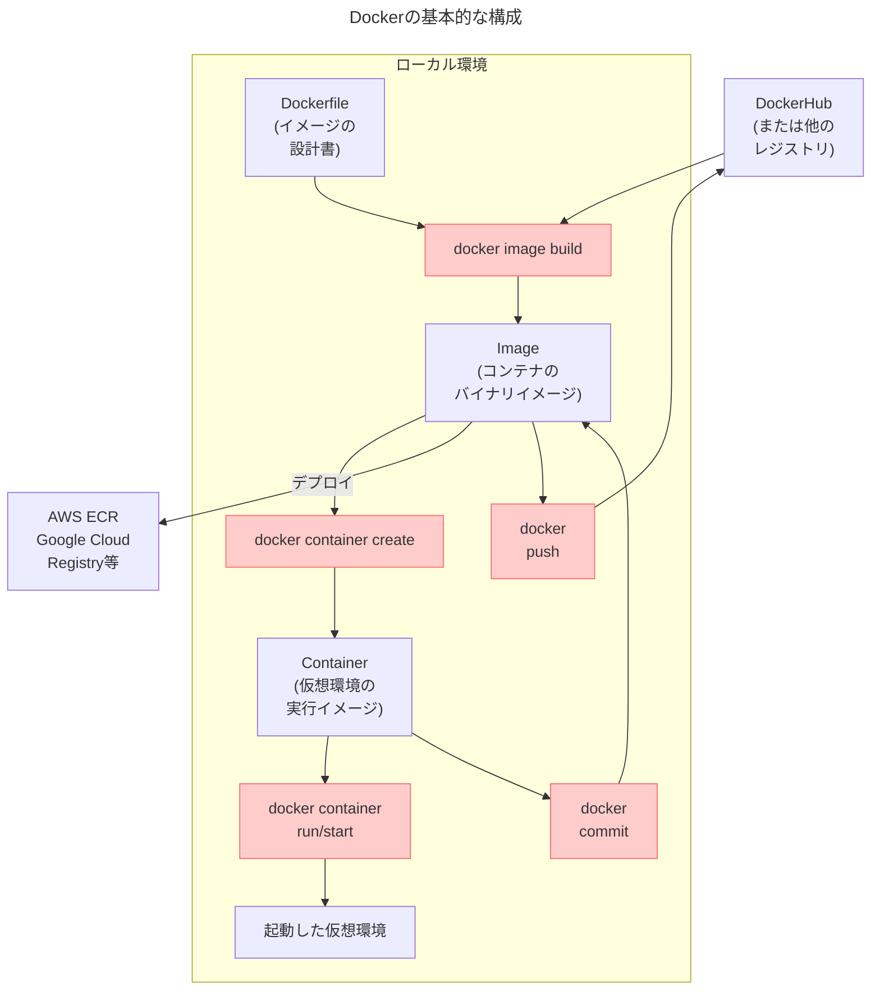
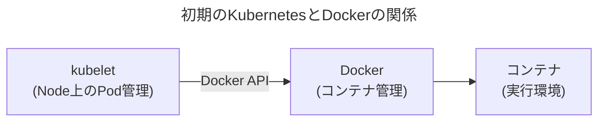
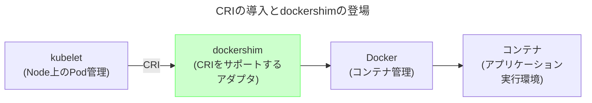
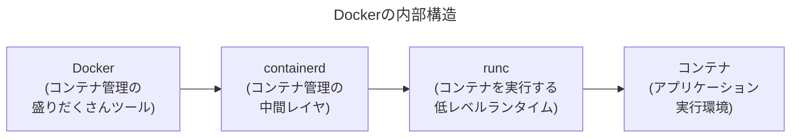
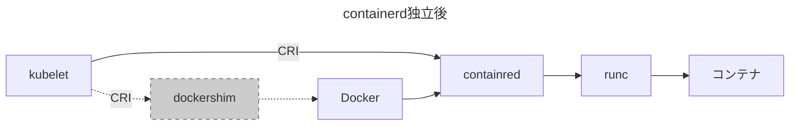
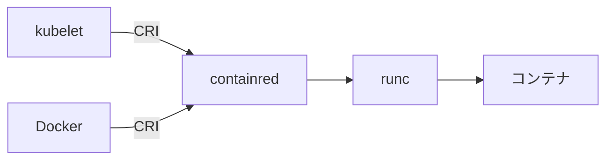
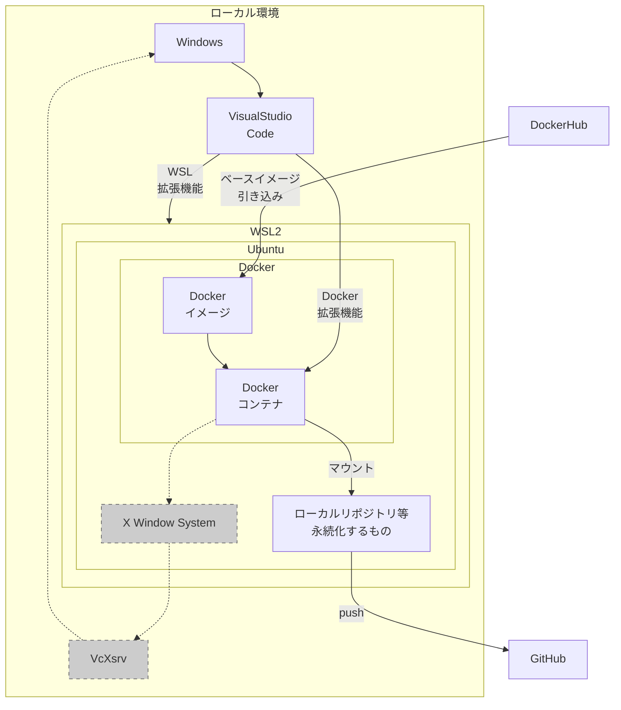

おじさんパイソン勉強しちゃうぞーと思ったら`C:\Users\私の 名前\AppData\Roaming\Python\Python313\Scripts`みたいになって草。~~だからWinは~~
やっぱリナックスよと思ってWSLからDocker上げたらKubernetesがサポートしてない？Dockerオワタて書いた人が燃えてたり何があったんや(15年くらい技術から離れてた人)
調べたことの自分用メモ。

##  WSL
WindowsのWSL(Windows Subsystem for Linux)は2020年Ver2になり、Hyper-V仮想環境で(本物の)Linuxカーネルが動くようになった(それまではLinuxシステムコールを片っ端からWindowsシステムコールに変換していた)。オーバーヘッドは5%弱と無視できる範囲(ただしLinux ⇔ Windows間ファイルシステムIOに限って激遅になる。ファイル管理もWSL上で完結し、コードはGitHubに投げておけば問題ない)。

|機能|WSL|WSL2|
|--|--|--|
|カーネル|擬似的なLinuxカーネル、互換性問題の可能性|Hyper-Vで動作する本物のカーネル|
|ファイルシステム|Windows管理下|仮想ファイルシステムでLinux準拠|
|Windowsファイルシステムとの連携|そのまま|遅い。ファイル数多いと顕著|

WSL自体はLinuxじゃなくてプラットフォーム。ディストリビューションを選べるし複数distro共存も可能。

## コンテナ仮想化技術
WSLでUbuntu上げたとして、そこにPythonやらNode.jsやらぶち込むとどんどん環境変わっていくし、何より複数人で環境揃えるのが面倒。なので仮想環境を上げて作業したほうが幸せ。
VMwareのようなハードウェア仮想化と違って、Dockerのようなコンテナ仮想化ではホストOS(のカーネル)を共有するため、ほとんどオーバーヘッドが発生しない。またapt installとかで環境変わるときは、その手順を一々書き残すよりコンテナ再構築したほうが早いし確実(コンテナ使い捨て運用)。DockerならDockerfileに手順を追記していけば、コマンド2つでイメージ構築・コンテナ作成までできる。
|アーキテクチャ|HW仮想化<br>(VMware等)|コンテナ仮想化<br>(Docker, containerd等)|
|--|--|--|
|仮想化レベル|ハードウェアを丸ごと仮想化|OSレベル仮想化|
|OS依存性|なし<br>(ゲストOSを自由に選択できる)|ホストOSとカーネルを共有<br>(ほぼLinuxが前提になる)|
|オーバーヘッド|それなりに大きい|最低限|
|リソース消費|ゲストOS分のリソース<br>(CPU、メモリ、ストレージ)|最低限|

企業インフラ構築ではVMware等も積極的に使われているが、クラウドはコンテナ仮想化が一般的。この流れはDockerとKubernetesの功績。

## Dockerコンテナ

Dockerはイメージ構築・コンテナ起動／管理を行うパッケージ。
- ごくシンプルな設計書(Dockerfile)を準備するだけで、DockerHub等で配布されているベースイメージ(Ubuntu, Python, PostgreSQL等)を引き込みコンテナのイメージを構築できる
- イメージからコンテナを作成、実行。これだけで仮想環境が完成
- 必要に応じてコンテナの状態をイメージとして保存(イメージはコンテナのスナップショット)
- 複数のコンテナを同時に制御できる(Docker compose)。DB・Webサーバ等を立ち上げ、コンテナ間通信も容易。
- 作ったコンテナは他のメンバーと共有、そのままクラウドサービスにデプロイできる。


Dockerfileの例:
```dockerfile:Dockerfile
# Python Dockerイメージをベースに利用
FROM python:3.13.1-slim
# GitやNumPyインストール(環境変更はここに書き足すだけ)
RUN apt update && apt install -y git && \
    apt-get clean && rm -rf /var/lib/apt/lists/* && \
    pip install --no-cache-dir numpy
# 作業ディレクトリの設定
WORKDIR /app
# デフォルトの実行コマンド
CMD ["bash"]
```
環境を変えるときはここに書き足していけばOK。`docker iamge build`一発で構築完了する。

## KubernetesとDockerとcontainerd
ここで躓いたのでメモ。
かつてKubernetesとDockerはセットで語られてた(このへんは何となく知ってる)。
Kubernetes(K8s)は多数のノード(≒サーバ)上でのコンテナ上げ下げ、リソース配分、死活監視とかやってる。Googleはこれで[惑星規模のコンテナを管理](https://kubernetes.io/ja/)してるらしい。
Dockerはコンテナ仮想技術を広めた立役者。KubernetesとDockerは蜜月関係だった。



Dockerは開発者に便利な機能満載で一気に業界標準になったが、Kubernetesとしてはコンテナ実行環境だけあればいいので、Dockerを挟む経路は(Kubernetesとしては)冗長だし、ベンダロックインやオーバーヘッドの問題を抱えることになった。
2016年、KubernetesがCRI(Container Runtime Interface)を発表。DockerはCRIをサポートしていないので、アダプターのdockershimが介入することになった。



で、実際にはDockerは内部でcontainerd(コンテナ管理を担当する中間レイヤ)、runc(コンテナを実行する低レベルランタイム)を利用している(どっちもDocker製、現在はオープンソース化)。これらの存在はDocker使ってて意識することはない。



全部書くと大変なことになってる。


2017年、Dockerは自身がCRIをサポートする代わりに、containerdをCNCF(Cloud Native Computing Foundation)に移譲。containerdがCRIをサポートすることで、dockershimは役割を終える。



2020年Kubernetesは**dockershim**を非推奨にし、2022年Kubernetesから削除。この過程でDokcerオワタ勢が出てきたりややこしくなったが、何のことはないDockerで作ったコンテナはKubernetesで普通に動くし開発作業はDockerのほうが便利。[Dockerは非推奨じゃないし今すぐ騒ぐのをやめろ](https://jaco.udcp.info/entry/2020/12/03/172843)がとても分かりやすい。



この流れで影響が出たのはDocker in Dockerみたいな特殊なケースだけ。DockerHubもガンガン使われてるしDocker使うこと自体まったく影響ない。

## WSL上でのDocker利用

ここまで理解してDocker入門関係の情報を漁ると、たいがいWindowsにDocker Desktopをインスコしようねってなってる。けど色々試して、これは使わないことにした。
Docker DesktopはGUIでイメージ構築、コンテナ実行までできる。ただ、これをインストールしてみるとWSL上に謎のディストリビューション「docker-desktop」が現れる。
```powershell
PS C:\Users\takak> wsl -l --verbose          #導入されているdistro一覧
  NAME              STATE           VERSION
* Ubuntu            Running         2        #自分で導入したもの
  docker-desktop    Running         2        #???
PS C:\Users\takak> wsl -d docker-desktop     #ログインしてみる
$ cat /etc/os-release
PRETTY_NAME="Docker Desktop"                 #???
$ sudo --help
-sh: sudo: not found                         #うーん
```
調べたら、Docker Desktopはこのディストリビューション上でコンテナを実行してるみたい。どうせ開発作業はコンテナ上で完結するから必要最小限の構成で、なんならログインも非推奨のもよう。
[Dockerのドキュメント](https://docs.docker.jp/desktop/windows/wsl.html)では
> Docker Desktop では何らかの Linux ディストリビューションをインストールする必要はありません。 docker CLI と UI は追加の Linux ディストリビューションがなくても動作します。しかしながら、**最高の開発体験を得るためには、少なくとも１つのディストリビューションを追加**し、次のようにして Docker サポートを有効化するのを推奨します。

？結局、何かのdistro入れろってなってる。確かにDocker Desktopでも、

どのdistro使うか選択できるみたい。
？？そんならdocker-desktopって要らなくね？？

WSLで書いたみたいに、WSL(2)からWindowsのファイルシステム使うとオーバーヘッドが大きいから、ファイル管理はWSLで完結させたい。コンテナは環境変えるたびにどんどん使い捨てていくので、SSHキーや書いたソースコードをコンテナ上に放置すると消えてしまう。なので、コンテナからWSLファイルシステムをマウントするのが最適解になるけど、そのWSL上の謎のdistroにログインもしないでってのは勝手が悪い。
コンテナ裏側の動作が秘匿されるのも構造理解の障壁になる。結局WSLにUbuntu入れて、その上にLinux版Dockerを導入してコンテナを立ち上げるのがシンプルで早い(しDockerDesktopでマウス使う必要もない)という結論になった。

## 最終的に作った環境

こんな感じになった(mermaidで形整えるの難しいので見にくいのは許してください)。


VisualStudio CodeからWSL拡張機能でWSL上のファイルシステムにアクセスできるし、Dev Containers拡張機能でコンテナ内に直接アタッチできるし、Docker拡張機能でDocker Desktopに近いことできるし、Python拡張機能でデバッグもできる(Dockerを使わずcontainerdだけだと、コンテナ内にSSH立てて経由する必要がある。このあたりDockerの方がやっぱり便利)。GitのローカルリポジトリはホストOSになるUbuntu上に作成し、コンテナ側からマウントすることでコンテナを乗り換えても保存される。
WindowsにVcXsrvを入れれば、X Window SystemからDISPLAYポート経由でLinuxデスクトップを使えることも確認した(けど必要性はないので満足して終わった)。
具体的な手順は別記事に。
