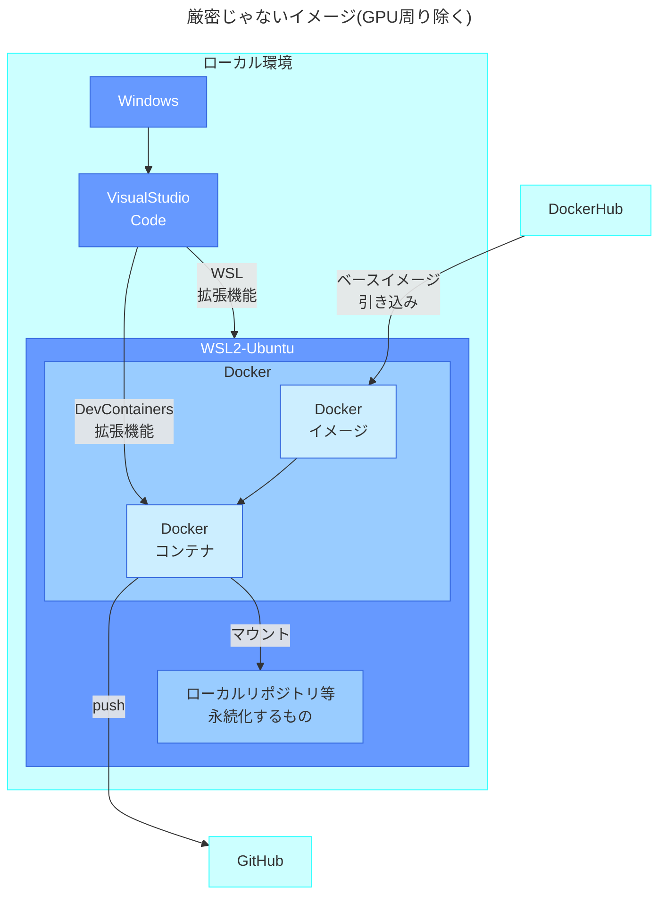
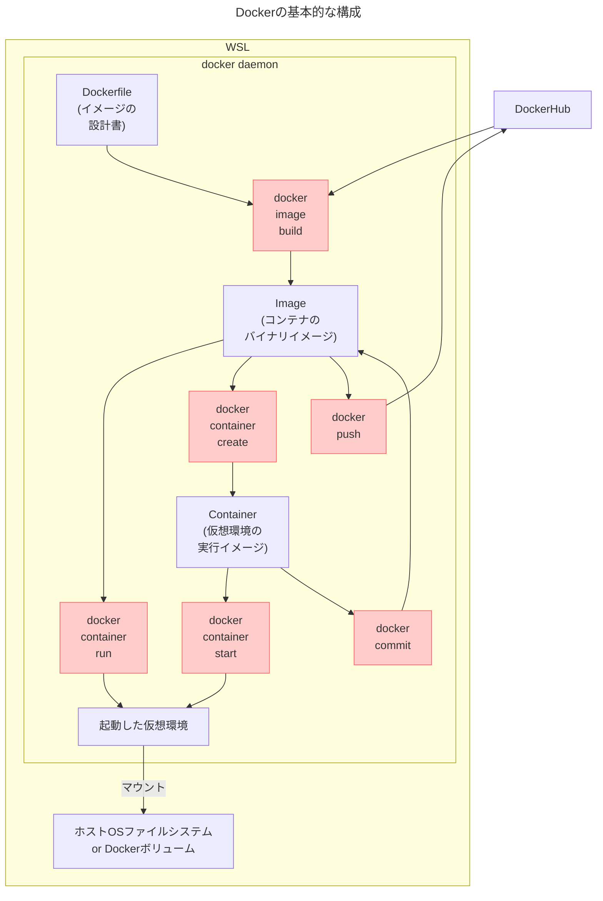
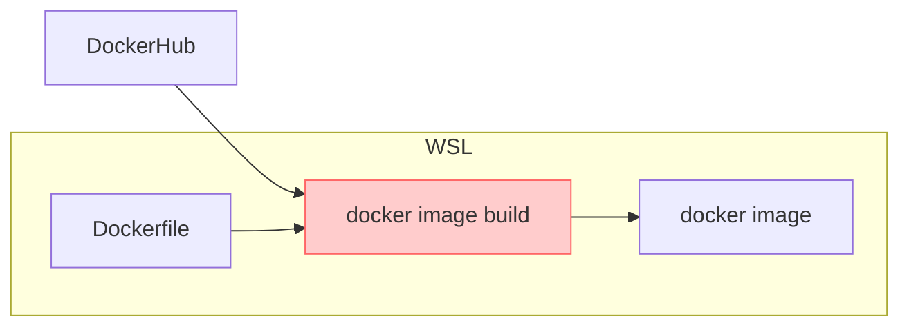
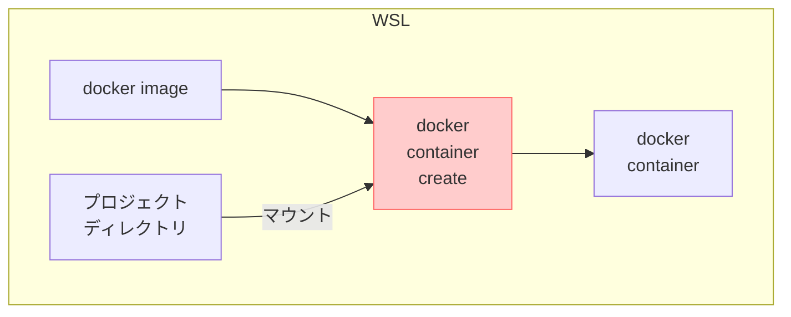
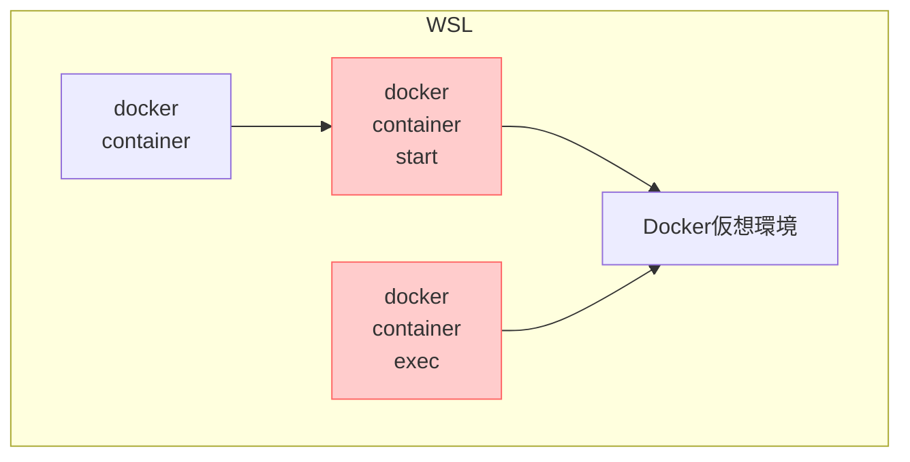
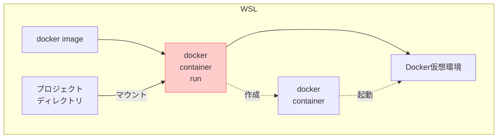

WinでDockerでGPU使うPythonコード書くよその③VSCode+Docker編。
[その1 概要](https://zenn.dev/tabirider/articles/tr-windows-ve-1)
[その2 WSL・Ubuntu](https://zenn.dev/tabirider/articles/tr-windows-ve-2)

:::message
`PowerShell`と`WSL-Ubuntu`と`Docker`コンテナ内が混じるので、
`>`→PowerShell
`$`→WSLのUbuntu
`#`→Dockerコンテナ
:::

WinでDockerでGPU使うPythonコード書くよその③WSL+Ubuntu。

## 環境の概要

- Windows上のWSL2上のUbuntu上のDockerコンテナでPythonをNumbaでJITしてCUDAからGPU使える環境
- GitのローカルリポジトリはWSL上に保持しDockerコンテナから操作
- Visual Studio CodeでWSL、DockerコンテナにアタッチしPython書いたりデバッグ




## Visual Studio Code導入

[公式](https://azure.microsoft.com/ja-jp/products/visual-studio-code)。導入後、左の拡張機能アイコンから`Japanese Language Pack`, `WSL`, `Dev Containers`あたりをインストール。`Python`関連の拡張機能はここでは不要。

### WSL上でVSCodeを実行する方法

WSLの開きたいディレクトリで`code .`と叩けばOK。`root`で入って実行すればVSCodeもrootユーザで起動する。

```powershell:PowerShell
> #rootでUbuntuに入る
> wsl -u root -d ubuntu
```

`code`と打つだけで、**なぜかWindows上のVSCodeが起動**する。

```shell-session:WSL
$ code .
```

:::message

なんでこうなるかというと
```shell-session:WSL
$ whereis code
code: /mnt/c/Users/～/AppData/Local/Programs/Microsoft VS Code/bin/code
```

ということは...

```shell-session:WSL
$ echo $PATH #うわぁあぁあ
/usr/local/sbin:/usr/local/bin:/usr/sbin:/usr/bin:/sbin:/bin:/usr/games:/usr/loc
al/games:/usr/lib/wsl/lib:/mnt/c/Python312/Scripts/:/mnt/c/Python312/:/mnt/c/Win
dows/system32:/mnt/c/Windows:/mnt/c/Windows/System32/Wbem:/mnt/c/Windows/System3
2/WindowsPowerShell/v1.0/:/mnt/c/Windows/System32/OpenSSH/:/mnt/c/Program Files
(x86)/NVIDIA Corporation/PhysX/Common:/mnt/c/WINDOWS/system32:/mnt/c/WINDOWS:/mn
t/c/WINDOWS/System32/Wbem:/mnt/c/WINDOWS/System32/WindowsPowerShell/v1.0/:/～～
```

WSLは[既定値でPATHにWindowsパスを追加](https://zenn.dev/tabirider/articles/tr-windows-ve-2#%E8%87%AA%E5%8B%95%E3%83%9E%E3%82%A6%E3%83%B3%E3%83%88%E3%81%AE%E8%A8%AD%E5%AE%9A)するので、Windowsのプログラムも叩ける。
  ```shell-session:WSL
  $ calc.exe #Windowsの電卓が出る
  ```
このおかげで、たまに意図しないWindowsのサービスを叩いてしまったりするので注意。WSLはコンテナ立ち上げ用と割り切ったほうが事故を防げそうな気がする。※コンテナ内ではこういうことは起こらない(ので、この方法ではコンテナからVSCodeは起動しない)。

:::

`WSL`拡張機能を導入して、左下の`リモート ウィンドウ`から`WSL への接続`を選択してもいい。


または`Ctrl`+`Shift`+`P`で`wsl`を入力。


あとは`ファイル(F)`→`フォルダーを開く(F)`でディレクトリを指定すれば、WSL上のファイルを直接編集できる。

> VSCodeはデフォルトでGitリポジトリの内部ファイルなどを無視する設定が入っているので、表示されないファイルがあるのに注意。VSCodeから`Ctrl`+`,`で設定を開き、`files.exclude`を入力すると、VSCodeが無視するファイルを確認できる。


## プロジェクトディレクトリ作成

Dockerコンテナは環境を変える度に乗り換えていくので、ソースコードなど永続化したいものはホストOS(WSL-Ubuntu)に作成し、コンテナからマウントする。
ひとまず`home`に`python_sandbox`を作成。

```shell-session:WSL
$ cd ~
$ mkdir python_sandbox
```


## Docker仮想環境の立ち上げ(単純なPython実行Docker編)

[DockerHub](https://hub.docker.com/)にはPythonやnginx、PostgreSQL等のイメージがアップされていて、イメージを引っ張るだけでたいがいの環境を作れる。流れはこんな感じ。(GitやGPU関連は後回し。まず動くコンテナを立ち上げる)



### Dockerのインストール

[公式](https://docs.docker.com/engine/install/ubuntu/#install-using-the-repository)に準じたほうが間違いないです。

```shell-session:WSL
$ #おきまり
$ sudo apt update
$ #おきまり
$ sudo apt -y upgrade
$ # リポジトリとHTTPS通信の準備
$ sudo apt install -y ca-certificates curl gnupg lsb-release
$ # DockerのGPGキーを取得して登録
$ sudo install -m 0755 -d /etc/apt/keyrings
$ sudo curl -fsSL https://download.docker.com/linux/ubuntu/gpg -o \
  /etc/apt/keyrings/docker.asc
$ sudo chmod a+r /etc/apt/keyrings/docker.asc
$ # リポジトリ設定
$ echo \
  "deb [arch=$(dpkg --print-architecture) \
  signed-by=/etc/apt/keyrings/docker.asc] \
  https://download.docker.com/linux/ubuntu \
  $(. /etc/os-release && echo "$VERSION_CODENAME") stable" | \
  sudo tee /etc/apt/sources.list.d/docker.list > /dev/null
$ sudo apt update
$ # Docker関係のインストール(今回は無償版のcommunity edition)
$ sudo apt install -y \
    docker-ce \
    docker-ce-cli \
    containerd.io \
    docker-buildx-plugin \
    docker-compose-plugin
$ # バージョン確認
$ docker version
Client: Docker Engine - Community
 Version:           27.4.1
～～
$ # dockerグループに追加
$ sudo usermod -aG docker $USER
$ newgrp docker
$ groups
$ # グループにdocker追加を確認
docker adm dialout ～～
```

### Dockerfileの準備

VSCodeで`/home/(ユーザ名)/python_sandbox/`を開き、新規ファイルで`Dockerfile`を作成。これがDockerイメージの設計図になる。

```dockerfile:Dockerfile
# Python Dockerイメージをベースに利用
FROM python:slim

# 例としてNumPyのインストール
RUN apt update && apt upgrade -y && \
    apt-get clean && rm -rf /var/lib/apt/lists/* && \
    pip install --no-cache-dir numpy

# 作業ディレクトリの設定
WORKDIR /app

# デフォルトの実行コマンド
CMD ["bash"]
```

### dockerイメージファイルの作成

- Dockerイメージは**静的なバイナリ**で、いちど構築したらコンテナ立ち上げても**イメージは変更されない**。
- 通常はDockerHub等からベースイメージを持ってきて、必要に応じて追加のパッケージをインストールしたりする。この指示をするのがDockerfile。
- イメージの修正(`apt install`等)が必要なときは、Dockerfileに追記してイメージを再作成。
- 自分で作成したイメージをDockerHubやGitHub Packages等にアップできる。



```shell-session:WSL
$ #作業用ディレクトリで実施
$ cd ~/python_sandbox
$ #イメージビルド(Dockerfileを指定)
$ docker image build -t python_sandbox_img -f Dockerfile .
$ #構築されたイメージを確認
$ docker image ls
REPOSITORY           TAG       IMAGE ID       CREATED        SIZE
python_sandbox_img   latest    6164e5960282   25 hours ago   195MB

$ #Dockerfileは省略してもいい(デフォ値がDockerfileになっているため)
$ docker image build -t python_sandbox .
```

### Dockerコンテナの作成

コンテナはイメージファイルをベースに、ボリュームマウントやネットワーク設定、リソース割当等を行った実行環境。イメージファイルは静的だが、コンテナは実行中にファイル作成やapt installなんかでどんどん変化していく。
※実装的には、コンテナは**Dockerイメージに読み書き可能なコンテナレイヤが追加**されたもの。コンテナ操作でイメージが変更を受けないのはこの構造のため。コンテナ作ってもDockerイメージのバイナリがコピーされることはなく、コンテナレイヤが増えるだけ。



```shell-session:WSL
$ #コンテナ作成(appに作業用ディレクトリをマウント)
$ docker container create -it --name python_sandbox_container \
  -v ~/python_sandbox:/app python_sandbox_img

$ #作ったコンテナを確認(-aオプションを指定しないと、停止中のコンテナは表示されない)
$ docker container ls -a
CONTAINER ID   IMAGE                COMMAND   CREATED          STATUS    PORTS     NAMES
3f78efc74b59   python_sandbox_img   "bash"    10 seconds ago   Created             python_sandbox_container
```

### Dockerコンテナの起動

まずコンテナを立ち上げ、コンテナ上でbashを実行してみる。



```shell-session:WSL
$ #コンテナを起動
$ docker container start python_sandbox_container
python_sandbox_container

$ #起動しているか確認
$ docker container ls -a
CONTAINER ID   IMAGE                COMMAND   CREATED              STATUS          PORTS     NAMES
3f78efc74b59   python_sandbox_img   "bash"    About a minute ago   Up 17 seconds             python_sandbox_container

$ #起動しているコンテナに入る(デフォルトではrootで入るようになっている)
$ docker container exec -it python_sandbox_container bash

# #OS確認
# cat /etc/os-release
# #PythonのベースイメージはDebianらしい
PRETTY_NAME="Debian GNU/Linux 12 (bookworm)"
NAME="Debian GNU/Linux"
VERSION_ID="12"
～～

# #カーネル確認→WSLと同じ(共有している)
# cat /proc/version
Linux version 5.15.167.4-microsoft-standard-WSL2 (root@f9c826d3017f) (gcc (GCC) 11.2.0, GNU ld (GNU Binutils) 2.37) #1 SMP Tue Nov 5 00:21:55 UTC 2024
# exit
exit
```

コンテナは`run`/`start`で起動したとき、やることがないと一瞬で終了する。`Dockerfile`で`CMD ["bash"]`を指定しているのは、コンテナに仕事を与えるため。

### Dockerイメージから一発でコンテナ起動

明示的にコンテナを作らなくても、`docker container run`(または`docker run`)でイメージから一発起動できる。何なら`--rm`オブションつければ、コンテナから抜けた時点でコンテナ自体が削除される。



```shell-session:WSL
$ #--rm指定でrunを実行。コンテナ名の指定も不要
$ docker container run -it --rm -v ~/python_sandbox:/app python_sandbox_img
# #仮想環境が上がる
# exit
$ #コンテナを確認
$ docker container ls -a
CONTAINER ID   IMAGE     COMMAND   CREATED   STATUS    PORTS     NAMES
$ #コンテナは消えている
```

同じコンテナを長く使い続けると、手が滑って`apt install`してDockerfileの内容から乖離したりする(デフォだとコンテナはでrootで上がるから尚更)。[Dockerのドキュメント](https://docs.docker.com/reference/cli/docker/)でも真っ先に`docker run`が紹介されてるあたり、コンテナは使い捨て運用がいいよ、ということらしい。

### Visual Studio CodeからDockerコンテナに接続

コンテナを立ち上げ、Visual Studio Codeを**WSLに接続している状態で**拡張機能`Dev Containers`を有効にしていると、左下`><`から`実行中のコンテナにアタッチ`が選択できる。

これで実行中のコンテナに接続すると、VSCodeから直接コードの編集ができる。
この状態で`Python`拡張機能を導入。

Python関係の拡張機能はコンテナ内に導入される(VSCodeの拡張機能は接続先によって導入場所が変わる)。`フォルダーを開く`で`/app`を開きファイル作成。これでPythonのデバッグ環境が完成。

> VSCodeを**WSLに接続していない状態で**`実行中のコンテナにアタッチ`すると、
> 
> ?勇気を出して`インストール`
> 
> ???もう怖いので`キャンセル`。VSCodeは接続先で挙動が変わるので要注意。

> よく見たら、VSCodeの`Dev Containers`拡張は勝手にコンテナに色々やってくれるらしい。
> 
> まあ有り難いんだけど、この拡張機能を使うかどうかでコンテナの挙動が変わるのが問題。ホストOS側設定を勝手にコンテナに適用されると予想外の影響が出て逆に手こずる原因になるし、挙げ句`Dev Containers`が有効な状態で`wsl --shutdown`したらご丁寧にも**即座にWSLを再起動してくれる** 。~~だからMS苦手なんよ~~
> こういうのを防ぐには`Dev Containers`右クリック→`設定`で要らないのは極力落とし、コンテナはCLIで起動し、拡張機能は`実行中のコンテナにアタッチ`しか使わない。ついでに普段使わないときは拡張機能自体を無効にしておいたほうが無難。

> VSCodeでWSLに入って`Docker`拡張機能を有効にすると、イメージ・コンテナをVSCodeの画面から確認できる。
  
> ちなみに、ここから`CONTAINER`の`+`押すだけでalpineが勝手に入る。なにこれこわい。
  
> VSCodeもDockerも後ろで色々やってくれるイメージ。けどこういうのはあんまり好きじゃない。

### Pythonを書いてみる

普通に動く。


### Dockerコンテナの停止

VSCodeを閉じてから。でないと**勝手にコンテナ再起動しようとするからね。**

```shell-session:WSL
$ #コンテナを停止
$ docker container stop python_sandbox_container
python_sandbox_container

$ #停止していることを確認
$ docker container ls -a
CONTAINER ID   IMAGE                COMMAND   CREATED         STATUS                       PORTS     NAMES
3f78efc74b59   python_sandbox_img   "bash"    6 minutes ago   Exited (137) 5 seconds ago             python_sandbox_container
```

### Dockerコンテナの削除

```shell-session:WSL
$ #コンテナを削除
$ docker container rm python_sandbox_container
python_sandbox_container

$ docker container ls -a
$ #消えている
CONTAINER ID   IMAGE     COMMAND   CREATED   STATUS    PORTS     NAMES

$ #CONTAINER IDの先頭数文字(コンテナを識別できる範囲)指定でもOK
$ docker container rm 3f78
```

### Dockerイメージの削除

```shell-session:WSL
$ #イメージの確認
$ docker image ls -a
REPOSITORY       TAG       IMAGE ID       CREATED        SIZE
python_sandbox   latest    b99460de47d9   10 hours ago   195MB

$ #イメージの削除
$ docker image rm python_sandbox
Untagged: python_sandbox:latest
Deleted: sha256:b994～
```


続き：[④SSH接続・GitHub連携編](https://zenn.dev/tabirider/articles/tr-windows-ve-4)