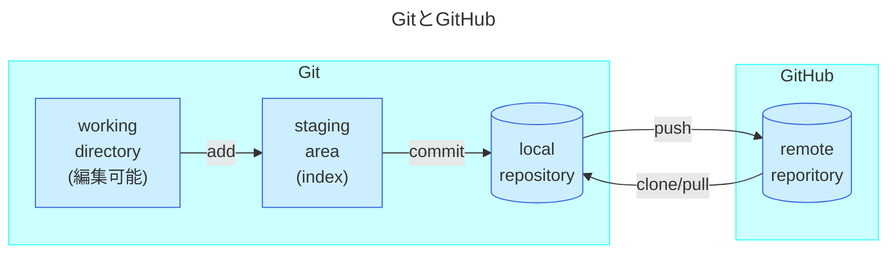
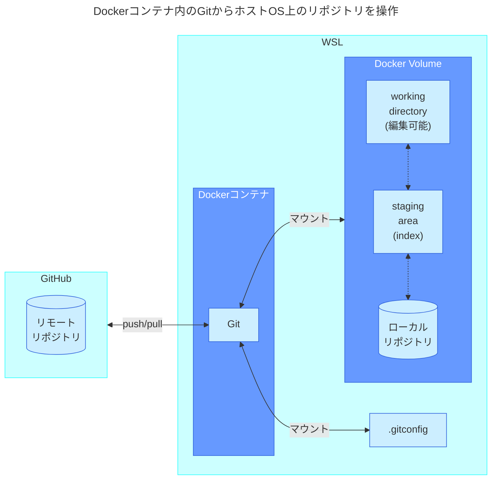
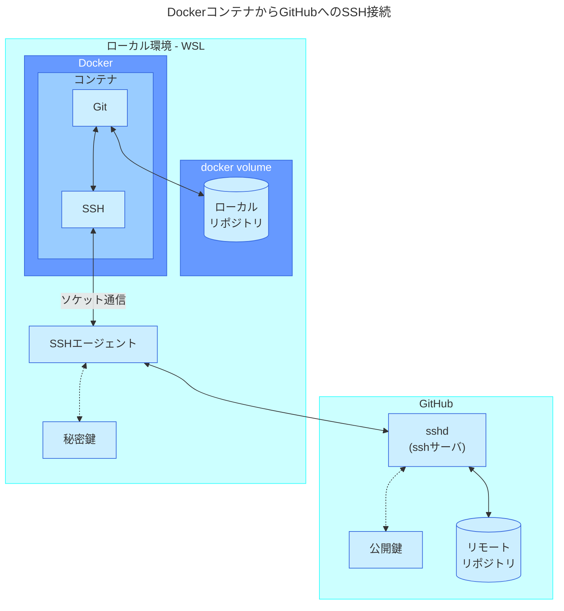

WinでDockerでGPU使うPythonコード書くよその④SSH接続・GitHub連携編。
[その1 概要](https://zenn.dev/tabirider/articles/tr-windows-ve-1)
[その2 WSL・Ubuntu](https://zenn.dev/tabirider/articles/tr-windows-ve-2)
[その3 単純なDocker](https://zenn.dev/tabirider/articles/tr-windows-ve-3)

:::message
`PowerShell`と`WSL-Ubuntu`と`Docker`コンテナ内が混じるので、
`>`→PowerShell
`$`→WSLのUbuntu
`#`→Dockerコンテナ
:::

## 今回作る環境の概要

### GitとGitHub

だいたいこんな感じ。



Gitの中で直接ファイルを編集できるのはワーキングディレクトリ（作業ツリー）。そこからステージングエリアに移行して、コミットするとローカルリポジトリが更新される。ステージングは競合解決や、必要なファイルだけコミットするための仕組み。ステージングエリアへの移行はファイル・行単位、コミットはステージングエリアにいるファイル一式まとめて、のイメージ。
GitHubにリポジトリ(リモートリポジトリ)を作成し、そこにpushすれば他のメンバーと共有できる。

### コンテナでのGit操作

コンテナでこの仕組みを扱う場合は、Gitリポジトリ関連ファイル・`.gitconfig`(ユーザ名等を登録するファイル)はホストOS(WSL)上に保持し、コンテナに導入したGitから操作する。これでコンテナを乗り換えてもリポジトリやconfigの内容は失われない。



前回はDockerコンテナからホストOS(WSL)側のディレクトリを直接マウントしてファイルを保存したが、それだとファイル毎の所有者やパーミッションとか面倒になり、何よりホスト側にファイルが散らかってしまう。極力ホスト側はきれいに保ちたいので今回は`docker volume`機能を利用。コンテナ外に**コンテナ専用のボリューム**を作成するもの。ホスト側から直接ボリュームの中身は参照できないが、コンテナで全ての操作を完結させるから問題ないしホストOSを汚さないし、複数コンテナからの同時参照もできる。

### GitとGitHubの連携

GitHubにはSSHで接続する。

:::message
ここも盛大に躓いたのでメモ。[公式はGitHubとの接続にSSHよりHTTPSを推奨](https://docs.github.com/ja/get-started/getting-started-with-git/set-up-git#connecting-over-https-recommended)してる。SSHとセキュリティに差はないし、SSHポートは塞がれがちだけどHTTPSはどこでもつなげるよ、みたいな感じ。
HTTPS接続時、Gitではパスワード認証が廃止されていて、代わりに`PAT(Personal Access Token)`での認証が求められる。特に、`Fine-grained tokens`は非常に詳細なパーミッション設定ができる(25年1月時点で`Preview`だけど[公式では強く推奨](https://docs.github.com/ja/authentication/keeping-your-account-and-data-secure/managing-your-personal-access-tokens#personal-access-token-%E3%81%AE%E7%A8%AE%E9%A1%9E))。
ところが、そのトークンは長いのでパスワードのように入力できず、コピペが必要。
`git config --global credential.helper cache`
`git config --global credential.helper "cache --timeout=7200"`
とかで入力したPATを一定時間キャッシュできるが、無限には伸ばせないしWSL落とせば消える。`libsecret`を使えばトークンを永続化できるが、そのためには`libsecret`のインストールが必要で、それをGitから使えるようビルドとパス通しが必要で、トークンを保存するために`GNOME Keyring`みたいなサービスを上げる必要があり、Keyringとの通信に`dbus`を上げる必要がある。
ここまでなら1度設定すればOKだけど、コンテナからのPAT認証を考えるとコンテナ内で同じ手続きを踏むのはさすがにめんどいし、コンテナ再構築したらKeyringに記憶させたPATも消える。コンテナからホストOS側のKeyringを参照することはできるが、そのためにdbusを経由する必要があり、そのためのソケットをコンテナにマウントする必要があり、そうこうしてるうちに変に外部依存するコンテナになってしまう。
ChatGPT先生に聞いたら、DockerfileにPATベタ書きすれば？って教えてくれた。
`ENV GITHUB_PAT ～～秘密のPERSONAL_ACCESS_TOKEN～～`
**これもう**(何のためにPATしてんのか)**分かんねぇな**
大人しくSSHでつなぐことにした。
:::

- コンテナ側にはGitとSSH(クライアント)を導入
- ホストOS側にはSSHキー(秘密鍵)を配置しSSHエージェントを起動
- コンテナ側のSSHはソケット通信でSSHエージェントにつなぎ、GitHubに接続

コンテナ側で毎回SSHエージェントを上げるのは面倒。コンテナ作成時にSSHキーをコピーすることはできるが、コンテナイメージにSSHキーを持たせるのはあまりよろしくない。Windows10以降にバンドルされているOpenSSHサービスのソケットをWSLから使うこともできるが、あんまりスマートに思えない。色々試してこの形がなんか落ち着いた。



## GitHubとのSSH接続

### GitHubアカウント作成

[GitHubのサイト](https://github.co.jp/)でアカウント作成。まず無償版で。
※GitHubでは2段階認証が必要。スマホにGitHubアプリがオススメ。Google AuthenticatorでもOK 。あとはサイトの指示通り。

### GitHubでリポジトリ作成

GitHubの`Dashboard`から`Top repositories`→`New`でリポジトリ名を入力。
`Public`か`Private`は用途によって指定。ひとまず`README`ファイル→不要、`.gitignore`→`None`、`licence`→`None`で`Create repository`。

|内容|プライベートリポジトリ|パブリックリポジトリ|
|--|--|--|
|`pull`|所有者・招待ユーザのみ|無制限|
|`push`|所有者・招待ユーザのみ|所有者・招待ユーザのみ<br>pull requestで変更を提案|
|用途|プライベートプロジェクト|オープンソース・公共プロジェクト|
|コスト|無償※|無償※|

> Freeプランでどちらも利用可能。

### SSHキー作成

ここでは暗号化に推奨されている`Ed25519`を利用。パスフレーズは省略も可(だが非推奨)。
```shell-session:WSL
$ ssh-keygen -t ed25519 -C "メール@アドレス" -f ~/.ssh/id_ed25519_github
Generating public/private ed25519 key pair.
Created directory '/home/～/.ssh'.
$ #パスフレーズ入力
Enter passphrase (empty for no passphrase):
$ #もっかい
Enter same passphrase again:
Your identification has been saved in /home/～/.ssh/id_ed25519_github
Your public key has been saved in /home/～/.ssh/id_ed25519_github.pub
The key fingerprint is:
SHA256:～～
The key's randomart image is:
+--[ED25519 256]--+
|    .o.     ..   |
～～
|  .. .o.=.   .   |
+----[SHA256]-----+
$ #鍵ができてる
$ ls ~/.ssh/
id_ed25519_github  id_ed25519_github.pub
$ #公開鍵を参照
$ cat ~/.ssh/id_ed25519_github.pub
ssh-ed25519 ～～
```

### GitHubにSSHキー登録

↑の`id_ed25519_github.pub`の中身(`ssh-ed25519 ～`)をコピーしてGitHubに登録。**秘密鍵じゃなくて公開鍵のほう。**
GitHubのサイトから右上のアイコン→`Settings`→`SSH and GPG keys`→`New SSH key`で`Title`を何か分かる名前にしておいて、`Key`にコピーしたテキストをそのまま貼り付け→`Add SSH key`。2段階認証かけてたらスマホから承認。

### SSH接続の確認

```shell-session:WSL
$ #接続してみる
$ ssh -T -i ~/.ssh/id_ed25519_github git@github.com
The authenticity of host 'github.com (～～)' can't be established.
ED25519 key fingerprint is SHA256:～～
This key is not known by any other names.
$ #初めて登録する先だよ→yes
Are you sure you want to continue connecting (yes/no/[fingerprint])? yes
$ #既知の接続先として登録したよ
Warning: Permanently added 'github.com' (ED25519) to the list of known hosts.
$ #パスフレーズ入力
Enter passphrase for key '/home/～/.ssh/id_ed25519_github':
$ #成功
Hi ～! You've successfully authenticated, but GitHub does not provide shell access.
Connection to github.com closed.
```

### .ssh/configファイル作成

毎回キーを入力しなくていいように、configファイルを作成しておく。

```shell-session:WSL
$ nano ~/.ssh/config
```

VSCodeから書いてもOK。以下の内容を記載

```
Host github.com
  HostName github.com
  User git
  IdentityFile ~/.ssh/id_ed25519_github
  AddKeysToAgent yes
```

|configの記述|意味|
|---|---|
|Host|SSH接続時の名前(エイリアス)。`github.com`の代わりに`gh`にすると、SSH接続を`ssh gh`みたいに書ける|
|HostName|リモートホストの指定。IPアドレスでもOK|
|User|SSH接続のユーザ名。GitHubは`git`ユーザで接続する決まりなので、変えると接続できない|
|IdentityFile|さっき作った鍵の片割れ(秘密鍵のほう)を指定|
|AddKeysToAgent|yesを指定するとエージェントがSSHキーを覚えてくれる|

### SSHエージェント起動をスクリプトに追加

SSHエージェントはSSHに代わって秘密鍵を読み込み、パスフレーズを記憶してくれる。シェル起動時にSSHエージェントを上げ、作成したSSHキーを読み込むよう設定。

```shell-session:WSL
$ nano ~/.bashrc
```

`.bashrc`はシェル起動時に読み込まれるスクリプト。末尾に以下の内容追記。

```shell
# Start ssh-agent if not already running
if ! pgrep -u "$USER" ssh-agent > /dev/null 2>&1; then
    eval "$(ssh-agent -s)"
    ssh-add ~/.ssh/id_ed25519_github
fi
```

> `eval "$(ssh-agent -s)"`について
> まず`ssh-agent -s`が実行され、SSHエージェントが起動する。-sは環境変数の設定情報を出力するオプション。  `ssh-agent -s`だけを実行するとこんな感じ。
  ```
  $ ssh-agent -s
  SSH_AUTH_SOCK=/tmp/ssh-～～/agent.～; export SSH_AUTH_SOCK;
  SSH_AGENT_PID=～; export SSH_AGENT_PID;
  echo Agent pid ～;
  ```
> `eval "$(～)"`で↑の出力結果が再度シェルで実行され、`export`で2つの環境変数がシェルに設定される。

> `ssh-add ~/.ssh/id_ed25519_github`について
> これでSSHエージェントにSSHキーが登録され、以降SSHはSSHエージェント経由で通信できるようになる。パスフレーズ付きの鍵を指定した場合、.bashrcにこれを組み込むとWSL起動時にパスフレーズを聞かれるようになる。

### SSHエージェントの起動確認

いちどWSLを落として再起動。
> このときVSCodeをWSLにつないだままだと**VSCodeが勝手にWSLを再起動し、その際上記の`~/.bashrc`は実行されずSSHエージェントも起動しない**のでVSCodeも閉じておく。色々やってくれるのは便利だけど裏目に出るのが多い感じ。

```powershell
$ exit
> wsl --shutdown  #WSLの全distroを終了
> wsl             #再起動してログイン→SSHキーのパスフレーズを聞かれる
Enter passphrase for /home/～/.ssh/id_ed25519_github:
Identity added: /home/～/.ssh/id_ed25519_github (メール@アドレス)
```

```shell-session:WSL
$ ps aux | grep ssh
$ #SSHエージェントが起動している
～      306  0.0  0.0   8300   764 ?        Ss   15:11   0:00 ssh-agent -s
～      368  0.0  0.0   4088  2036 pts/0    S+   15:13   0:00 grep --color=auto ssh
$ #接続テスト→パスフレーズ聞かれず通れば成功
$ ssh -T git@github.com
Hi ～! You've successfully authenticated, but GitHub does not provide shell access.
```

ここまででホストOS側からGitHubへの接続設定が完了。

## Gitの設定

まずホストOS側でGitを導入し、基本的な設定を済ませておく。

```shell-session:WSL
$ sudo apt install -y git                         #Gitを導入
$ git config --global user.name "ユーザ名"         #おきまり
$ git config --global user.email "メール@アドレス" #おきまり
$ git config --global init.defaultBranch main     #masterじゃなくてmainにしようね
$ git config -l                                   #設定内容の確認
user.name=ユーザ名
user.email=メール@アドレス
init.defaultbranch=main
$ cat ~/.gitconfig                                #configの場所はここ
[user]
        name = ユーザ名
        email = メール@アドレス
[init]
        defaultBranch = main

```

作成された`.gitconfig`をコンテナにマウントすれば、コンテナ側で毎回設定する必要はない。

## Docker Volumeの準備

Docker Volumeはコンテナ用のボリューム(記憶領域)をホストOS側に作成する機能。ホスト側から中身は見えない。

```shell-session:WSL
$ #ボリューム作成
$ docker volume create python_sandbox_vol
python_sandbox_vol
$ #作成したボリュームを確認
$ docker volume ls
DRIVER    VOLUME NAME
local     python_sandbox_vol
$ #ボリュームの詳細情報
$ docker volume inspect python_sandbox_vol
[
    {
        "CreatedAt": "2025-01-19T21:45:53+09:00",
        "Driver": "local",
        "Labels": null,
        "Mountpoint": "/var/lib/docker/volumes/python_sandbox_vol/_data",
        "Name": "python_sandbox_vol",
        "Options": null,
        "Scope": "local"
    }
]
$ #実際に作成される場所はここ(sudoが必要)
$ sudo ls -l /var/lib/docker/volumes/
total 28
brw------- 1 root root 8, 32 Jan 18 10:36 backingFsBlockDev
-rw------- 1 root root 32768 Jan 19 21:45 metadata.db
drwx-----x 3 root root  4096 Jan 19 21:45 python_sandbox_vol
```

## コンテナの起動

### Dockerfile

今回はこんな感じで。

```dockerfile:Dockerfile
# ベースイメージにUbuntuを指定
FROM ubuntu:latest

# Git, SSH, Pythonを導入
RUN apt update && apt upgrade -y && \
    apt install -y \
        git \
        python3 \
        ssh \
    && apt clean && rm -rf /var/lib/apt/lists/*

# 作業ディレクトリの設定
WORKDIR /app

# デフォルトの実行コマンド
CMD ["bash"]
```

[Dockerfileのベストプラクティス](https://docs.docker.jp/develop/develop-images/dockerfile_best-practices.html)も参照。

- コンテナは可能な限り一時的(使い捨て)であるべき
- レイヤ数を最小に。[マルチステージビルド](https://docs.docker.jp/develop/develop-images/dockerfile_best-practices.html#id9)で最終イメージの容量を節約できる
- 不要なパッケージは入れない
- 各コンテナはただ一つの用途を持つべき
- apt installなどはアルファベット順に並べ重複を見つけやすく
- 変更頻度の低い順番からレイヤを作成すると効率的

### コンテナ作成・起動

```shell-session:WSL
$ #イメージビルド
$ docker image build -t python_sandbox_img .
$ #コンテナ実行(使い捨て型)
$ docker run --rm -it \
  -e SSH_AUTH_SOCK=/ssh-agent \
  -v $SSH_AUTH_SOCK:/ssh-agent \
  -v python_sandbox_vol:/app \
  -v ~/.gitconfig:/root/.gitconfig:ro \
  python_sandbox_img
```

`docker run`のオプションが増えてきたので整理。

|option|内容|
|--|--|
|`--rm`|クリーンアップ(片付け)。コンテナは終了時に消える。永続化したいデータはdocker volumeに格納するので問題ない。|
|`-i`|インタラクティブモード。**標準入力**を有効にする。|
|`-t`|ターミナル割当。`-i`と`-t`の動きは後ろの「おまけ」参照|
|`-e`|コンテナ内で使う環境変数を設定。ここではSSHクライアントが`ssh-agent`ソケットを使うよう指示している。|
|`-v`|ボリュームをマウント。ここでは3種類マウントしている。<br>`$SSH_AUTH_SOCK:/ssh-agent` ホストOS側のSSHエージェントのソケット<br>`python_sandbox_vol:/app` 準備しておいたDockerVolumeを`/app`にマウント<br>`~/.gitconfig:/root/.gitconfig:ro` ホストOS側で設定したGitのconfigファイル|

> SSHとSSHエージェントについて
  SSH(クライアント)はコンテナ内にインストールしている。コンテナからSSH通信するとき、SSHクライアントは環境変数`SSH_AUTH_SOCK`をチェックする。ここで`-e SSH_AUTH_SOCK=/ssh-agent`によって`/ssh-agent`を割り当てているが、コンテナ内にそのパスは存在しない。そこで、`-v $SSH_AUTH_SOCK:/ssh-agent`でホストOS側SSHエージェントのソケットをマウントしている。
  ホストOS側で環境変数`$SSH_AUTH_SOCK`を見てみるとこんな感じ。

  ```shell-session:WSL
  $ echo $SSH_AUTH_SOCK
  /tmp/ssh-DoyO204yuCLN/agent.555
  ```

> このパスはWSL再起動のたびに変わるので、環境変数を参照したマウントを行っている。実際にこのパスを見てみると

  ```shell-session:WSL
  $ ls $SSH_AUTH_SOCK -l
  total 0
  srw------- 1 devuser devuser 0 Jan 20 17:03 agent.555
  ```

> 先頭の`s`はソケットの意味、しっかり実在している。SSHエージェントが上がっていないとこの環境変数は設定されないので、**VSCodeが勝手に再起動したWSL**とか特に注意。

## コンテナからのGit操作

SSH接続ができれば、あとはサクッと通るはず。

### コンテナからのGitHub疎通確認

```shell-session:Container
# ssh -T git@github.com
The authenticity of host 'github.com (～～)' can't be established.
ED25519 key fingerprint is SHA256:～～
This key is not known by any other names.
# #既知の接続先はコンテナ内の~/.ssh/known_hostsで管理されてるので、ここでも聞かれる。yes
Are you sure you want to continue connecting (yes/no/[fingerprint])? yes
Warning: Permanently added 'github.com' (ED25519) to the list of known hosts.
# #これでOK
Hi ～! You've successfully authenticated, but GitHub does not provide shell access.
# ssh -T git@github.com
# #2回目は聞かれない
Hi ～! You've successfully authenticated, but GitHub does not provide shell access.
#
```

### ローカルリポジトリ作成

`/app`はDocker Volumeにマウントしているので、ここで作成したファイルはコンテナを落としても消えない。とりあえず`python_sandbox`を作成。

```shell-session:Container
# cd /app
# mkdir python_sandbox
```

ここで`git init`を実行するとフォルダ内に`.git`が作成され、同時にこのフォルダがGitローカルリポジトリとして機能するようになる。

```shell-session:Container
# cd python_sandbox/ #作成したディレクトリに移動
# git init
Initialized empty Git repository in /app/python_sandbox/.git/
# ls -la
～
# #↓これがリポジトリの正体。これを消すとローカルリポジトリは完全に消える
drwxr-xr-x 7 root root 4096 Jan 20 08:29 .git
```

### ローカルリポジトリとGitHubリポジトリの連携

GitHubのサイトで作成したリポジトリに移動し、SSHのアドレスをコピー。

```shell-session:WSL
# #これもローカルリポジトリ内で実行
# git remote add origin git@github.com:～～/～～.git #git@～はコピーしたアドレス
# git remote -v
origin  git@github.com:～～/～～.git (fetch)
origin  git@github.com:～～/～～.git (push)
```

これで紐付け完了。

### Git操作

まず何かファイル書く。


```shell-session:Docker
# git status #リポジトリの状態確認→test.pyがUntracked(ステージングされてない)
On branch main

No commits yet

Untracked files:
  (use "git add <file>..." to include in what will be committed)
        test.py

nothing added to commit but untracked files present (use "git add" to track)
# git add .   #全ファイルをステージング
# git status  #コミット未済のファイルがあるよ
On branch main

No commits yet

Changes to be committed:
  (use "git rm --cached <file>..." to unstage)
        new file:   test.py
# git commit -m "test commit" #コミット
On branch main
nothing to commit, working tree clean
```

### GitHubへのpush

```shell-session:Docker
# git push -u origin main #pushしてみる
Enumerating objects: 3, done.
～～
Total 3 (delta 0), reused 0 (delta 0), pack-reused 0
To github.com:～～/python_sandbox.git
 * [new branch]      main -> main
```

push成功すればGitHubのサイトで確認できる。


## おまけ1: ヘルプ見れない

これで一通りの開発はできるけど、Docker版Ubuntuはミニマムな構成で`man`も`vim`もない。コンテナは極力サイズを押さえたいからだけど、開発環境には不便なことも。

```shell-session:Docker
# git push --help
This system has been minimized by removing packages and content that are
not required on a system that users do not log into.

To restore this content, including manpages, you can run the 'unminimize'
command. You will still need to ensure the 'man-db' package is installed.
```

ログインしなけりゃ要らないのは入ってないよ。`unminimize`実行してね。

```shell-session:Docker
# unminimize #やってみる
bash: unminimize: command not found
```

（#^ω^）ﾋﾟｷﾋﾟｷ

```shell-session:Docker
# apt install unminimize #こっから
～～
# unminimize #んで実行
～～
# git push --help #今度こそ
warning: failed to exec 'man': No such file or directory
fatal: no man viewer handled the request
```

（#^ω^）ﾋﾟｷﾋﾟｷ

```shell-session:Docker
# apt install man-db manpages manpages-posix manpages-posix-dev #まとめてぶっこむ
～～
# git push --help #やっと見れた
Start a build
Usage:  docker buildx build [OPTIONS] PATH | URL | -
～～
```

`Dockerfile`にも追記。`unminimize`は`-y`オプションがないから`yes`を食わせる。(途中でインタラクティブな操作が必要なコマンドを`RUN`するとビルドが失敗する)

```dockerfile:Dockerfile
# ベースイメージにUbuntuを指定
FROM ubuntu:latest

# インストール・unminimize
RUN apt update && apt upgrade -y \
    && apt install -y \
        git \
        man-db manpages manpages-posix manpages-posix-dev \
        python3 \
        ssh \
        unminimize \
    && yes | unminimize
    && apt clean && rm -rf /var/lib/apt/lists/*

# 作業ディレクトリの設定
WORKDIR /app

# デフォルトの実行コマンド
CMD ["bash"]
```

必要なのは都度`Dockerfile`に書き足してイメージビルドから繰り返すことになる。
`unminimize`はちょっと時間かかる。`Dockerfile`で`RUN`・`COPY`・`ADD`を実行すると、そこまでのレイヤがキャッシュされる仕組みがあるので、開発用コンテナと割り切って作るなら

```dockerfile:Dockerfile
# ベースイメージにUbuntuを指定
FROM ubuntu:latest

# アップデート
RUN apt update && apt upgrade -y
# マニュアル関係・unminimize(通常版Ubuntuに近い構成にする)
RUN apt install -y unminimize man-db manpages manpages-posix manpages-posix-dev \
    && yes | unminimize
# インストール
RUN apt install -y \
        git \
        python3 \
        ssh \
        vim \
    && apt clean && rm -rf /var/lib/apt/lists/*

# 作業ディレクトリの設定
WORKDIR /app

# デフォルトの実行コマンド
CMD ["bash"]
```

みたいに分割すれば2回目以降のビルドが速くなる。
(レイヤを重ねるからサイズはちょっと増えるけど、Windowsさんに比べたらねぇ・・)
ちなみに`COPY`・`ADD`でコンテナ内にファイルコピーするときは[ファイルのチェックサム見てる](https://docs.docker.jp/develop/develop-images/dockerfile_best-practices.html#leverage-build-cache)からファイルが変わればキャッシュは無効になる。すごい。

## おまけ2: 分からないようで分からない`-i`と`-t`

`-i`はコンテナに対して標準入力を受けるよう指示。
`-t`はコンテナに対してターミナルを割り当てる。
オプションをつけたり外してコンテナを起動すると、なんとなく動きが見えてくる。

```shell-session:WSL
$ docker run --rm python_sandbox_img # -i も -t も省略
$ #何事もなかったようにコンテナが終了しWSLに戻ってくる
$ docker container ls -a
CONTAINER ID   IMAGE     COMMAND   CREATED   STATUS    PORTS     NAMES
$ #コンテナは消えてる
$ docker run --rm -i python_sandbox_img # -iだけつけてみる
■■■ダンマリ■■■
$ #この状態からは[Ctrl]+[D]で脱出できる
$ docker container ls -a
CONTAINER ID   IMAGE     COMMAND   CREATED   STATUS    PORTS     NAMES
$ #コンテナは消えてる
$ docker run --rm -t python_sandbox_img # -tだけつけてみる
# #動いてる？ように見えるが
# ls
■■■ダンマリ■■■
exit
■■■ダンマリ■■■
# #この状態だと[Ctrl]+[D]でも抜けれない。[Ctrl]+[C]を3連打すると脱出できる
got 3 SIGTERM/SIGINTs, forcefully exiting
$ #WSLに戻ってこれた
$ docker container ls -a
$ #コンテナはまだ動いている↓
CONTAINER ID   IMAGE                COMMAND   CREATED          STATUS          PORTS     NAMES
e832ab03eb54   python_sandbox_img   "bash"    59 seconds ago   Up 9 seconds              awesome_bassi
$ docker container stop e832 #コンテナを終了させる
```

このコンテナは、`Dockerfile`で`bash`を実行するよう指定されている。

- `-i`も`-t`も省略すると、対話モードでなくターミナル割当もされないので、`bash`は**仕事がないと判断して終了**し、仕事をなくしたコンテナは`--rm`で削除される。
- `-i`だけ指定した場合、コンテナは対話モードで起動するので**標準入力からの**指示待ちになるが、`-t`でターミナルが割り当てられていないので、プロンプトが表示されることもなく、キー入力も受け取ってくれない。`Ctrl`+`D`で終了するのは、これが**標準入力に`EOF`を送出するから**。これでコンテナ内の`bash`は終了し、役目を終えたコンテナは削除される。
- `-t`だけ指定するとややこしくなる。コンテナにターミナルが割り当てられるので**動いてそうな雰囲気**になるけど、**コンテナは標準入力を閉じている**ため、ターミナルからのキー入力をシカトする。
  このとき`Ctrl`+`C`3連打でターミナルを抜けてWSLに戻ってくるのは、Docker CLIの仕様によるもの。`Ctrl`+`C`は標準入力に`SIGINT`(割込)シグナルを発生させるが、コンテナは標準入力を閉じてるからやっぱり無視する。3回続けて入力すると、Docker CLIが「もういいよね」ってなって**CLIプロセスを**抜けるため、画面上はホストOS側に復帰する。一方コンテナの`bash`は扉を閉ざして来ぬ便りを待ち続けるので、`docker stop`で落とすしかなくなる。

キーに対するシグナルの割当は`stty -a`で確認できる。

```shell-session:WSL
$ stty -a #キーに対するシグナルの一覧を表示
speed 38400 baud; rows 34; columns 138; line = 0;
intr = ^C; quit = ^\; erase = ^?; kill = ^U; eof = ^D; eol = <undef>; eol2 = <undef>; swtch = <undef>; start = ^Q; stop = ^S; susp = ^Z;
rprnt = ^R; werase = ^W; lnext = ^V; discard = ^O; min = 1; time = 0;
-parenb -parodd -cmspar cs8 -hupcl -cstopb cread -clocal -crtscts
-ignbrk -brkint -ignpar -parmrk -inpck -istrip -inlcr -igncr icrnl ixon -ixoff -iuclc -ixany -imaxbel -iutf8
opost -olcuc -ocrnl onlcr -onocr -onlret -ofill -ofdel nl0 cr0 tab0 bs0 vt0 ff0
isig icanon iexten echo echoe echok -echonl -noflsh -xcase -tostop -echoprt echoctl echoke -flusho -extproc
$ stty --help #その詳細
～～ ※多すぎる
$ stty --help | grep intr
   intr CHAR     CHAR will send an interrupt signal
$ #intr = ^C のintrは割込シグナル
$ kill -l #シグナルの一覧
 1) SIGHUP       2) SIGINT       3) SIGQUIT      4) SIGILL       5) SIGTRAP
 6) SIGABRT      7) SIGBUS       8) SIGFPE       9) SIGKILL     10) SIGUSR1
11) SIGSEGV     12) SIGUSR2     13) SIGPIPE     14) SIGALRM     15) SIGTERM
16) SIGSTKFLT   17) SIGCHLD     18) SIGCONT     19) SIGSTOP     20) SIGTSTP
21) SIGTTIN     22) SIGTTOU     23) SIGURG      24) SIGXCPU     25) SIGXFSZ
26) SIGVTALRM   27) SIGPROF     28) SIGWINCH    29) SIGIO       30) SIGPWR
31) SIGSYS      34) SIGRTMIN    35) SIGRTMIN+1  36) SIGRTMIN+2  37) SIGRTMIN+3
38) SIGRTMIN+4  39) SIGRTMIN+5  40) SIGRTMIN+6  41) SIGRTMIN+7  42) SIGRTMIN+8
43) SIGRTMIN+9  44) SIGRTMIN+10 45) SIGRTMIN+11 46) SIGRTMIN+12 47) SIGRTMIN+13
48) SIGRTMIN+14 49) SIGRTMIN+15 50) SIGRTMAX-14 51) SIGRTMAX-13 52) SIGRTMAX-12
53) SIGRTMAX-11 54) SIGRTMAX-10 55) SIGRTMAX-9  56) SIGRTMAX-8  57) SIGRTMAX-7
58) SIGRTMAX-6  59) SIGRTMAX-5  60) SIGRTMAX-4  61) SIGRTMAX-3  62) SIGRTMAX-2
63) SIGRTMAX-1  64) SIGRTMAX
```


続き：[⑤Numba・CUDA・GPU編](https://zenn.dev/tabirider/articles/tr-windows-ve-5)
