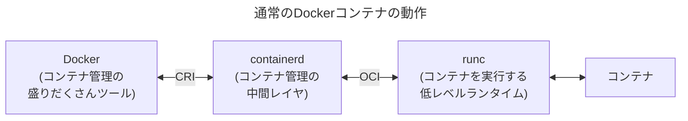
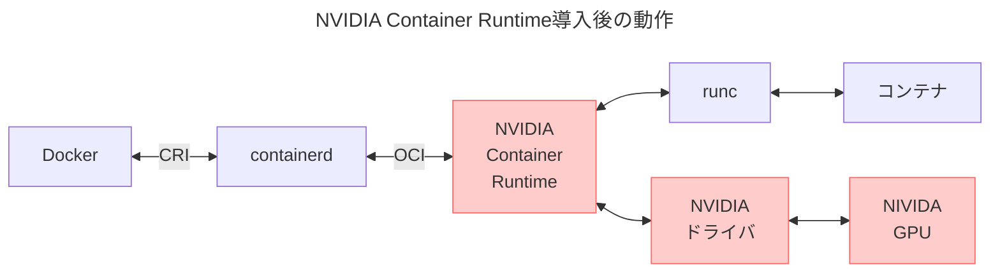
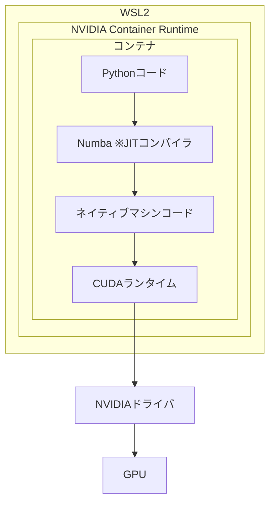

WinでDockerでGPU使うPythonコード書くよその⑤Numba・CUDA・GPU編。
[その1 概要](https://zenn.dev/tabirider/articles/tr-windows-ve-1)
[その2 WSL・Ubuntu](https://zenn.dev/tabirider/articles/tr-windows-ve-2)
[その3 単純なDocker](https://zenn.dev/tabirider/articles/tr-windows-ve-3)
[その4 SSH接続・GitHub連携](https://zenn.dev/tabirider/articles/tr-windows-ve-4)

## DockerコンテナでのGPU利用設定

Dockerコンテナは、内部でcontainerd(コンテナを管理する中間レイヤ)とrunc(コンテナを実行する低レベルランタイム)を利用している。これらはDockerを使っていて意識することはない。このあたりは[別記事](https://zenn.dev/tabirider/articles/tr-windows-ve-1#kubernetes%E3%81%A8docker%E3%81%A8containerd)。



> - CRI: Container Runtime Interface
>   GoogleがKubernetesの仕様として策定。containerdがCRIに対応していることで、同じコンテナをDockerでもKubernetesでも(原則的に)実行可能。
> - OCI: Open Container Initiative
>   ※実際にはコンテナ規格標準化の団体名だが、仕様の意味で使われることが多い。
    正確な仕様名は以下の通り。
    - OCI Runtime Specification: コンテナ実行の仕様
    - OCI Image Specification: コンテナイメージの仕様
    Dockerが作成したruncの仕様をベースにしている。

ただし、runcはGPUドライバに対応していない。なのでNVIDIA Container Runtimeを導入し、runcとの間に割り込ませる。これがruncをラッピングするように機能することで、コンテナがGPUリソースを使えるようになる。



また、コンテナ内にNVIDIA CUDA(Compute Unified Device Architecture)をインストールする。Pythonに加えてNumPyとNumbaも導入し、NumbaでCUDAを利用する形にPythonコードをJIT(Just-In-Time)コンパイルすることでGPUを使えるようになる。



＜条件＞

- `Win10 21H2`, `Win11`で`WSL2`を利用
- NVIDIA製GPUのみ
- NVIDIAドライバ510以降が必要

## NVIDIAドライバインストール

念のため[NVIDIAのサイト](https://www.nvidia.com/en-us/drivers/)から最新ドライバを導入。
ドライバのバージョンはPowerShellから確認できる。

```:PowerShell
> nvidia-smi
+-----------------------------------------------------------------------------------------+
| NVIDIA-SMI 566.36                 Driver Version: 566.36         CUDA Version: 12.7     |
|-----------------------------------------+------------------------+----------------------+
| GPU  Name                  Driver-Model | Bus-Id          Disp.A | Volatile Uncorr. ECC |
| Fan  Temp   Perf          Pwr:Usage/Cap |           Memory-Usage | GPU-Util  Compute M. |
|                                         |                        |               MIG M. |
|=========================================+========================+======================|
|   0  NVIDIA GeForce RTX 3060 Ti   WDDM  |   00000000:01:00.0  On |                  N/A |
|  0%   41C    P8             12W /  200W |     970MiB /   8192MiB |      4%      Default |
|                                         |                        |                  N/A |
+-----------------------------------------+------------------------+----------------------+

+-----------------------------------------------------------------------------------------+
| Processes:                                                                              |
|  GPU   GI   CI        PID   Type   Process name                              GPU Memory |
|        ID   ID                                                               Usage      |
|=========================================================================================|
|    0   N/A  N/A      3160    C+G   ...\cef\cef.win7x64\steamwebhelper.exe      N/A      |
～～
```


## NVIDIA Container Toolkitのインストール

[NVIDIAのサイト](https://docs.nvidia.com/datacenter/cloud-native/)参照。NVIDIA Container ToolkitのインストールでNVIDIA Container Runtimeが導入され、コンテナ上でGPUが使えるようになる。(Kubernetesの場合はNVIDIA Device Pluginの導入が必要。手順が異なるので注意)

[公式インストールガイド](https://docs.nvidia.com/datacenter/cloud-native/container-toolkit/latest/install-guide.html)に沿って導入。
```shell-session:WSL
$ curl -fsSL https://nvidia.github.io/libnvidia-container/gpgkey | \
  sudo gpg --dearmor -o /usr/share/keyrings/nvidia-container-toolkit-keyring.gpg \
  && curl -s -L https://nvidia.github.io/libnvidia-container/stable/deb/nvidia-container-toolkit.list | \
  sed 's#deb https://#deb [signed-by=/usr/share/keyrings/nvidia-container-toolkit-keyring.gpg] https://#g' | \
  sudo tee /etc/apt/sources.list.d/nvidia-container-toolkit.list
$ sudo apt-get update
$ sudo apt-get install -y nvidia-container-toolkit
```

DockerがNVIDIA Container Runtimeを使うように設定。
```shell-session:WSL
$ sudo nvidia-ctk runtime configure --runtime=docker
```
これで`/cat/docker/daemon.json`の`runtime`が更新される。
```shell-session:WSL
$ cat /etc/docker/daemon.json
{
    "runtimes": {
        "nvidia": {
            "args": [],
            "path": "nvidia-container-runtime"
        }
    }
}
```

## Python/NumPy/Numba/CUDA入りコンテナ作成

[NVIDIAのCUDA on WSLページ](https://docs.nvidia.com/cuda/wsl-user-guide/index.html#cuda-support-for-wsl-2)ではLinux用のCUDA入れると**ドライバが上書きされちゃうからダメ**と強く警告されてるが、

> The CUDA driver installed on Windows host will be stubbed inside the WSL 2 as `libcuda.so`, therefore **users must not install any NVIDIA GPU Linux driver within WSL 2**. One has to be very careful here as the default CUDA Toolkit comes packaged with a driver, and it is **easy to overwrite the WSL 2 NVIDIA driver with the default installation**.

**コンテナに導入する分にはWSLに影響ない**のでLinux版でOK。
ということで[CUDA Toolkitサイト](https://developer.nvidia.com/cuda-toolkit)から、コンテナのベースイメージに合うのを選択。


### Dockerfile準備

サイトの手順をDockerfileに追加する。前回の最終版に足しましょう。

```dockerfile:Dockerfile
# ベースイメージにUbuntuを指定
FROM ubuntu:latest

# アップデート
RUN apt update && apt upgrade -y

# マニュアル関係・unminimize(通常版Ubuntuに近い構成にする)
RUN apt install -y unminimize man-db manpages manpages-posix manpages-posix-dev \
    && yes | unminimize

# CUDA関連インストール
RUN wget https://developer.download.nvidia.com/compute/cuda/repos/ubuntu2404/x86_64/cuda-keyring_1.1-1_all.deb \
    &&  dpkg -i cuda-keyring_1.1-1_all.deb
    &&  apt update
    &&  apt -y install cuda-toolkit-12-6

# その他パッケージインストール
RUN apt install -y \
        git \
        python3 \
        ssh \
        vim \
    && apt clean && rm -rf /var/lib/apt/lists/*

# 作業ディレクトリの設定
WORKDIR /app

# デフォルトの実行コマンド
CMD ["bash"]```


### NVIDIAランタイムを使うコンテナを作成

```shell-session:WSL
$ #ランタイムにNVIDIAを指定し、GPUを利用する設定のコンテナを作成
$ docker container create -t --name python_sandbox -v ~/python_sandbox:/app \
  --runtime=nvidia --gpus all python_sandbox
$ #コンテナ立ち上げ
$ docker container start python_sandbox
$ #コンテナに入る
$ docker container exec -it python_sandbox bash
$ #NVIDIAのGPUが認識されているのを確認
# nvidia-smi
Thu Jan  9 05:48:31 2025
+-----------------------------------------------------------------------------------------+
| NVIDIA-SMI 565.77.01              Driver Version: 566.36         CUDA Version: 12.7     |
|-----------------------------------------+------------------------+----------------------+
| GPU  Name                 Persistence-M | Bus-Id          Disp.A | Volatile Uncorr. ECC |
| Fan  Temp   Perf          Pwr:Usage/Cap |           Memory-Usage | GPU-Util  Compute M. |
|                                         |                        |               MIG M. |
|=========================================+========================+======================|
|   0  NVIDIA GeForce RTX 3060 Ti     On  |   00000000:01:00.0  On |                  N/A |
|  0%   39C    P8             11W /  200W |    1217MiB /   8192MiB |      2%      Default |
|                                         |                        |                  N/A |
+-----------------------------------------+------------------------+----------------------+

+-----------------------------------------------------------------------------------------+
| Processes:                                                                              |
|  GPU   GI   CI        PID   Type   Process name                              GPU Memory |
|        ID   ID                                                               Usage      |
|=========================================================================================|
|    0   N/A  N/A        33      G   /Xwayland                                   N/A      |
+-----------------------------------------------------------------------------------------+
```
