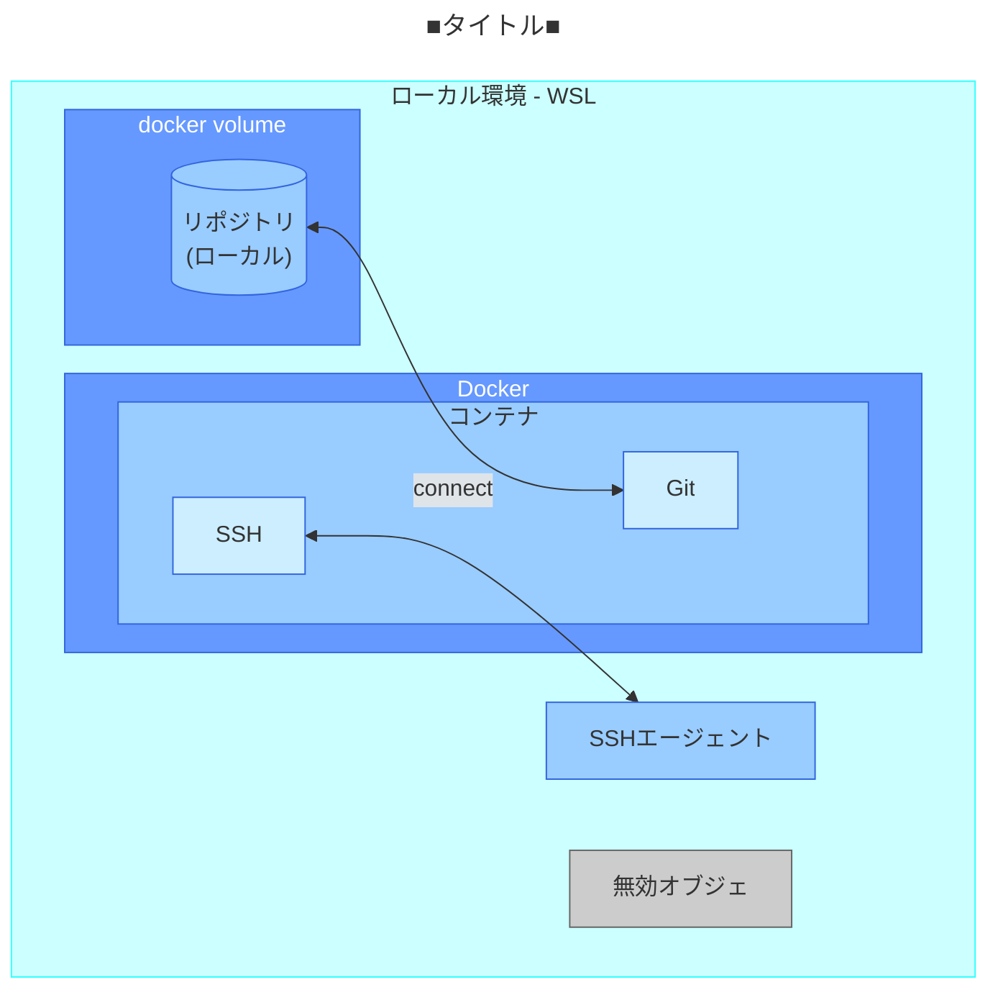

````markdown
<!-- コメント(1行のみ) -->

## 見出し
### 見出し
#### 見出し

- リスト
- リスト
  - リスト(ネスト)
  * リスト
1.  番号付きリスト
2.  番号付きリスト
    1. 番号付きリスト(ネスト)
        リストの中の記事

# リンク
[アンカーテキスト](https://www.google.co.jp)
<https://www.google.co.jp>

# 画像


# リンク付き画像
[](https://www.google.co.jp/)

# テーブル
|head|head|
|--|--|
|text|text|

# コードブロック
```
code
```

    行頭スペース4個でもコード記法になる

```python
print('hoge')
```

```python:hoge.py
print('hoge')
```

```diff js
@@ -4,6 +4,5 @@
    const foo = bar.baz([1, 2, 3]) + 1;
    let foo = bar.baz([1, 2, 3]);
```

# コードブロックに指定できるハイライト:
<https://prismjs.com/#supported-languages>
html, css, js, bash, c, cpp, csv, diff, docker, git, gitignore, go, http,
java, json, json5, jsonp, kotlin, log, md or markdown, mermaid, mongodb,
nginx, prel, php, plsql, powershell, py, shell-session, sql, tcl,
typescript or ts, url, wiki, yaml, etc.

# 数式
[KaTeX](https://katex.org/docs/support_table.html)

# 数式ブロック
$$
e^{i\theta} = \cos\theta + i\sin\theta
$$

# インラインの$a\ne0$数式埋め込み

#  引用
> 引用文

# 脚注
脚注[^1]の例。
インライン^[インラインの脚注の内容]も可能。

[^1]: 脚注の内容

# 区切り線
---

# Zenn独自拡張
::::message
メッセージ
::::

:::message alert
警告
:::

:::details アコーディオン
その中身
1.  番号付き
    ```
    コードブロック
    ```
:::

:::::details いろいろネスト
  ::::message
  ネストしたメッセージ
  :::message alert
  さらにネスト
  :::
  ::::
:::::

# カード
https://www.yahoo.co.jp

# カードがうまくいかない場合
@[card](https://www.yahoo.co.jp)

# リンクのみ
<https://www.yahoo.co.jp>

# X
https://x.com/jack/status/20
?conversation=noneでリプライ元ポスト非表示

# YouTube
https://www.youtube.com/watch?v=x3qaFHhh1jQ

# GitHub
ファイル単位
https://github.com/tabirider/zenn/blob/d45918a9ab42869fee0da3f2ca283e952e93dafc/github-sample/sample.txt

特定行
https://github.com/tabirider/zenn/blob/d45918a9ab42869fee0da3f2ca283e952e93dafc/github-sample/sample.txt#L3-L5

1行だけ
https://github.com/tabirider/zenn/blob/d45918a9ab42869fee0da3f2ca283e952e93dafc/github-sample/sample.txt#L3

# GitHub Gist
<https://gist.github.com>

@[gist](https://gist.github.com/tabirider/d16b2087fe404e2ca60b1ab7eb9308d8)

# CodePen(フロントエンド)
<https://codepen.io>
@[codepen](ページのURL)

# SlideShare(スライドをシェア)
<https://www.slideshare.net>
@[slideshare](スライドのkey)
埋め込みコードに含まれるdata-idの値を入力

# Docswell(スライドをシェア)
<https://www.docswell.com>
@[docswell](スライドのURL)
もしくは
@[docswell](埋め込み用のURL)
#スライドのURL（ https://www.docswell.com/s/{UserId}/{SlideId}-xxx-xxx ）、もしくは埋め込み用のURL( https://www.docswell.com/slide/{SlideId}/embed )を入力

# JSFiddle(フロントエンド)
<https://jsfiddle.net>
@[jsfiddle](ページのURL)
埋め込みオプションを指定する場合、iframe用の埋め込みURL(ページのURL+/embedded/{Tabs}/{Visual}/)を入力

# StackBlitz(フロントエンド)
<https://stackblitz.com>
@[stackblitz](embed用のURL)

# Figma(デザインツール)
<https://www.figma.com/ja-jp>
@[figma](ファイルまたはプロトタイプのURL)

# blueprintUEは使わないので省略

# mermaid
<https://mermaid.js.org/ecosystem/tutorials.html>

クリックイベント無効、ブロックあたり2000文字、ブロックあたりのChain数10以下


````


