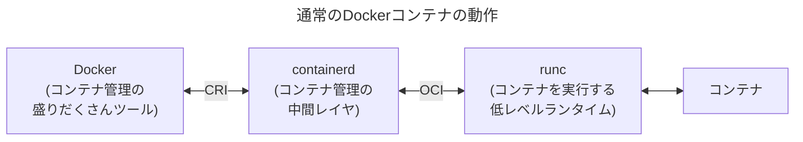
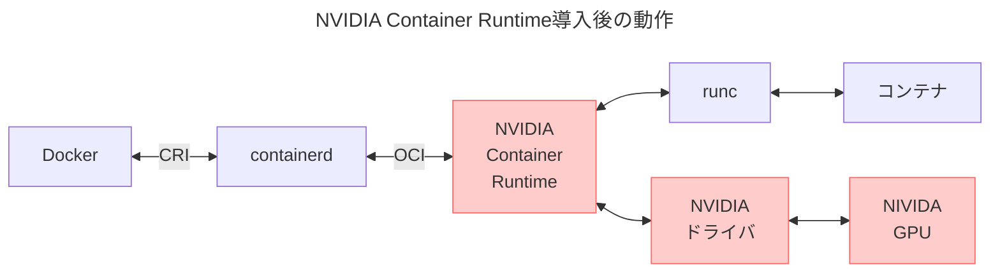
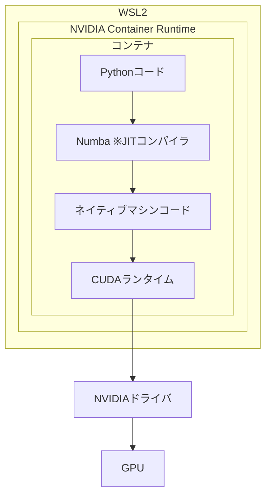

:::message
`PowerShell`と`WSL-Ubuntu`と`Docker`コンテナ内が混じるので、

```powershell:PowerShell
> #これはPowerShell
```

```shell-session:WSL
$ #これはWSL(Ubuntu)
```

```shell-session:Container
# #これはコンテナ内(基本rootで入ります)
```

```dockerfile:Dockerfile
# ↑ファイルの内容はファイル名
```
:::

## DockerコンテナでのGPU利用設定

1章のとおり、Dockerは内部でcontainerd(コンテナを管理する中間レイヤ)とrunc(コンテナを実行する低レベルランタイム)を利用している。これらはDocker使ってて意識することはない。



> - CRI: Container Runtime Interface
>   GoogleがKubernetesの仕様として策定。containerdがCRIに対応していることで、同じコンテナをDockerでもKubernetesでも(原則的に)実行可能。
> - OCI: Open Container Initiative
>   ※実際にはコンテナ規格標準化の団体名だが、仕様の意味で使われることが多い。
    正確な仕様名は以下の通り。
    - OCI Runtime Specification: コンテナ実行の仕様
    - OCI Image Specification: コンテナイメージの仕様
    Dockerが作成したruncの仕様をベースにしている。

ただし、runcはGPUドライバに対応していない。なのでNVIDIA Container Runtimeを導入し、runcとの間に割り込ませる。これがruncをラッピングするように機能することで、コンテナがGPUリソースを使えるようになる。



また、コンテナ内にNVIDIA CUDA(Compute Unified Device Architecture)をインストールする。Pythonに加えてNumPyとNumbaも導入し、NumbaでCUDAを利用する形にPythonコードをJIT(Just-In-Time)コンパイルすることでGPUを使えるようになる。



＜条件＞

- Win10 21H2～, Win11でWSL2
- NVIDIA製GPUのみ
- NVIDIAドライバ510以降

## NVIDIAドライバインストール

念のため[NVIDIAのサイト](https://www.nvidia.com/en-us/drivers/)からWindowsの最新ドライバを導入。
ドライバのバージョンはPowerShellから確認できる。

```:PowerShell
> nvidia-smi
+-----------------------------------------------------------------------------------------+
| NVIDIA-SMI 566.36                 Driver Version: 566.36         CUDA Version: 12.7     |
|-----------------------------------------+------------------------+----------------------+
| GPU  Name                  Driver-Model | Bus-Id          Disp.A | Volatile Uncorr. ECC |
| Fan  Temp   Perf          Pwr:Usage/Cap |           Memory-Usage | GPU-Util  Compute M. |
|                                         |                        |               MIG M. |
|=========================================+========================+======================|
|   0  NVIDIA GeForce RTX 3060 Ti   WDDM  |   00000000:01:00.0  On |                  N/A |
|  0%   41C    P8             12W /  200W |     970MiB /   8192MiB |      4%      Default |
|                                         |                        |                  N/A |
+-----------------------------------------+------------------------+----------------------+

+-----------------------------------------------------------------------------------------+
| Processes:                                                                              |
|  GPU   GI   CI        PID   Type   Process name                              GPU Memory |
|        ID   ID                                                               Usage      |
|=========================================================================================|
|    0   N/A  N/A      3160    C+G   ...\cef\cef.win7x64\steamwebhelper.exe      N/A      |
～～
```


## NVIDIA Container Toolkitのインストール

[NVIDIAのサイト](https://docs.nvidia.com/datacenter/cloud-native/container-toolkit/latest/index.html)参照。NVIDIA Container ToolkitのインストールでNVIDIA Container Runtimeが導入され、コンテナ上でGPUが使えるようになる。(Kubernetesの場合はNVIDIA Device Pluginの導入が必要。手順が異なるので注意)


[公式インストールガイド](https://docs.nvidia.com/datacenter/cloud-native/container-toolkit/latest/install-guide.html)に沿って導入。これは**コンテナ内じゃなくてWSLのほう**で。
```shell-session:WSL
$ curl -fsSL https://nvidia.github.io/libnvidia-container/gpgkey | \
  sudo gpg --dearmor -o /usr/share/keyrings/nvidia-container-toolkit-keyring.gpg \
  && curl -s -L https://nvidia.github.io/libnvidia-container/stable/deb/nvidia-container-toolkit.list | \
  sed 's#deb https://#deb [signed-by=/usr/share/keyrings/nvidia-container-toolkit-keyring.gpg] https://#g' | \
  sudo tee /etc/apt/sources.list.d/nvidia-container-toolkit.list
$ sudo apt-get update
$ sudo apt-get install -y nvidia-container-toolkit
```

DockerがNVIDIA Container Runtimeを使うように設定。
```shell-session:WSL
$ sudo nvidia-ctk runtime configure --runtime=docker
INFO[0000] Config file does not exist; using empty config
INFO[0000] Wrote updated config to /etc/docker/daemon.json
INFO[0000] It is recommended that docker daemon be restarted.
```
これで`/cat/docker/daemon.json`の`runtime`が更新される。
```shell-session:WSL
$ cat /etc/docker/daemon.json
{
    "runtimes": {
        "nvidia": {
            "args": [],
            "path": "nvidia-container-runtime"
        }
    }
}
$ #指示通りDockerを再起動
$ sudo service docker restart
```

## Python/NumPy/Numba/CUDA入りコンテナ作成

### 最新版Pythonの準備

前回は`apt install`でPythonを入れたけど、(25年1月時点で)バージョン3.12.3になってる(APTライブラリの更新は少し遅れがち)。Pythonは3.13からJIT機構※が導入され、パフォーマンスが向上している(はず)。
※Python3.13のJITはNumbaとは別もの。後述。
最新版(25年1月時点で3.13.1)のPythonを使うには、

- [DockerHub](https://hub.docker.com/search?q=python)からPythonを検索して最新イメージをベースに利用
  (Debianベースになるみたい。イメージをビルドしたDokcerfileもサイトから参照できる)
- [Pythonサイト](https://www.python.org/downloads/source/)から最新ソースをダウンロードしてコンパイル

など。コンテナを開発環境にするなら色々できたほうが便利なので、今回はUbuntuをベースイメージにして後者のコンパイルする方法を選択(まあまあ時間かかる)。まず最新版ソースをダウンロード。(3.13.1前提で)

```shell-session:WSL
$ cd ~/python_sandbox
$ curl -O https://www.python.org/ftp/python/3.13.1/Python-3.13.1.tar.xz
$ ls  # ファイルを落とせたのを確認
Dockerfile  Python-3.13.1.tar.xz  ～
```

これをDockerイメージビルドの中でコンパイルする。

### CUDAの準備

[NVIDIAのCUDA on WSLページ](https://docs.nvidia.com/cuda/wsl-user-guide/index.html#cuda-support-for-wsl-2)ではLinux用のCUDA入れると**ドライバが上書きされちゃうからダメ**と強く警告されてるが、

> The CUDA driver installed on Windows host will be stubbed inside the WSL 2 as `libcuda.so`, therefore **users must not install any NVIDIA GPU Linux driver within WSL 2**. One has to be very careful here as the default CUDA Toolkit comes packaged with a driver, and it is **easy to overwrite the WSL 2 NVIDIA driver with the default installation**.

**コンテナに導入する分にはWSLに影響ない**のでLinux版でOK。
[CUDA Toolkitサイト](https://developer.nvidia.com/cuda-toolkit)から、コンテナのベースイメージに合うのを選択。


この`Installation Instructions`をDockerfileに取り込む。

### Dockerfile準備

今回はこんな感じ。ubuntuをunminimizeして最新PythonをコンパイルしてNumpy, Numba, CUDAなど導入。`RUN`のたびにレイヤが重なるのと、コンパイラ関係でサイズが増えるけど、開発環境なので気にしない(クラウドにデプロイしたりするコンテナは最低限の構成に直したほうがいい)。

```dockerfile:Dockerfile
# ベースイメージにUbuntuを指定
FROM ubuntu:24.04

# ダウンロードしたPythonソースをコンテナ内にコピー(これはビルド時に削除)
COPY Python-3.13.1.tar.xz /tmp/

# 時間のかかる処理から実行してレイヤ構成。開発用なのでイメージサイズは気にしない。

# unminimize(通常版Ubuntuに近い構成にする)
RUN     apt update \
    &&  apt upgrade -y \
    &&  apt install -y unminimize \
    &&  yes | unminimize

# 必要なパッケージを導入しPythonをビルド
RUN     apt install -y \
            build-essential \
            libbz2-dev \
            libffi-dev \
            liblzma-dev \
            libncurses5-dev \
            libreadline-dev \
            libsqlite3-dev \
            libssl-dev \
            tk-dev \
            uuid-dev \
            wget \
            xz-utils \
            zlib1g-dev \
    &&  mkdir -p /usr/src/python \
    &&  tar -xJf /tmp/Python-3.13.1.tar.xz -C /usr/src/python --strip-components=1 \
    &&  rm /tmp/Python-3.13.1.tar.xz \
    &&  cd /usr/src/python \
    &&  ./configure --enable-optimizations --with-lto --with-ensurepip=install \
    &&  make -j$(nproc) \
    &&  make altinstall \
    &&  cd / \
    &&  rm -rf /usr/src/python \
    &&  ln -s /usr/local/bin/python3.13 /usr/local/bin/python \
    &&  ln -s /usr/local/bin/pip3.13 /usr/local/bin/pip

# CUDA関連インストール
RUN     wget https://developer.download.nvidia.com/compute/cuda/repos/ubuntu2404/x86_64/cuda-keyring_1.1-1_all.deb \
    &&  dpkg -i cuda-keyring_1.1-1_all.deb \
    &&  apt update \
    &&  apt -y install cuda-toolkit-12-6

# 基本的なコマンド・マニュアル関係(好きなの足していく)
RUN     apt install -y \
            curl \
            git \
            man-db \
            manpages \
            manpages-posix \
            manpages-posix-dev \
            nano \
            ssh \
            tree \
            vim

#Python関係ライブラリインストール
RUN     pip install --no-cache-dir \
            mypy \
            numba \
            numpy

#掃除(開発用コンテナでは省略)
#RUN     apt clean && rm -rf /var/lib/apt/lists/*

# 作業ディレクトリの設定
WORKDIR /app

# デフォルトの実行コマンド
CMD ["bash"]
```

これでDockerイメージを作成。
```shell-session:WSL
$ docker image build -t python_sandbox_img .  # 前と同じ
```

### NVIDIAランタイムを使うコンテナを起動

```shell-session:WSL
$ docker run --rm -it \
  -e SSH_AUTH_SOCK=/ssh-agent \
  -v $SSH_AUTH_SOCK:/ssh-agent \
  -v python_sandbox_vol:/app \
  -v ~/.gitconfig:/root/.gitconfig:ro \
  --runtime=nvidia \
  --gpus all \
  python_sandbox_img
```

- `--runtime=nvidia`は、`/cat/docker/daemon.json`に登録された`nvidia`に対応する(`daemon.json`に`default-runtime:`として`nvidia`を指定すれば、このオプションは不要)。
  これを省略すると`runc`が適用される。
- `--gpus`はコンテナに対してGPUデバイスを割り当てるもの。

これでCUDA経由でGPUを利用できるコンテナが起動する。
